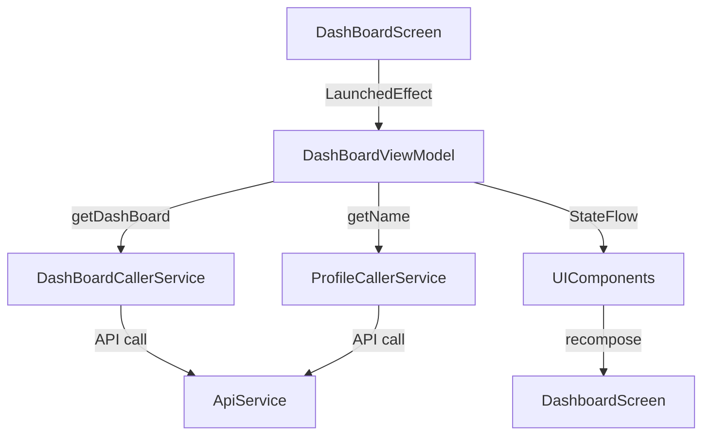

# Dashboard Screen

## UI Components

* `DashBoardLayout`: Global wrapper with screen layout.
* `InitialFadeIn`: Animation wrapper for smooth screen appearance.
* `LoadingDialog`: Full-screen loading indicator shown during data fetch.

### Widgets (Composable Components)

All widgets use `WidgetBase`, which wraps:

* `Box`: Containing content and a dropdown action menu.
* `Text`: Optional title or dynamic content (like welcome message).
* `IconButton + DropdownMenu`: Display contextual options (actions) via `WidgetMenuItem`.

#### Specific Widgets

* `HelloWidget`: Displays welcome message and number of user properties.
* `UnreadMessagesWidget`: Placeholder for unread message count.
* `ScheduledInventoryWidget`: Placeholder for scheduled inventory reports.
* `DamageInProgressWidget`: Placeholder for unresolved property damages.
* `AvailablePropertiesWidget`: Placeholder for available properties.

Each widget includes:

* `testTag`: For UI testing.
* `height` or `Column` for layout control.

---

## ViewModel

### `DashBoardViewModel`

Handles:

* `DashBoard`: Retrieved from `DashBoardCallerService`.
* `userName`: Retrieved from `ProfileCallerService`.
* `isLoading`: Used for showing `LoadingDialog`.

#### Functions

* `getDashBoard()`:

  * Fetches dashboard stats.
  * Updates `_dashBoard` state.
  * Wrapped with `Mutex` to prevent concurrent calls.
* `getName()`:

  * Retrieves first and last name from the profile API.

### State Observed

* `dashBoard`: Contains metrics (e.g., property count).
* `userName`: String used in greeting.
* `isLoading`: Controls loading dialog visibility.

---

## Functionality

* Fetches data on first screen load via `LaunchedEffect(Unit)`:

  * `getDashBoard()`: Calls dashboard API.
  * `getName()`: Fetches user profile for display.

* Displays:

  * Welcome message: `HelloWidget`
  * Placeholder widgets: `UnreadMessages`, `ScheduledInventory`, `Damages`, `AvailableProperties`

* Widgets are individually wrapped with `WidgetBase`, making them modular and extensible.

---

## Data Flow

---

## Navigation

* No explicit navigation within this screen.
* However, it uses `NavController` to inject into ViewModel and API services in case of logout or navigation actions from dropdowns (if added).

---

## API Integration

Relies on the following **ApiCallerService subclasses**:

### 🔹 `DashBoardCallerService`

* [`DashBoardCallerService`](../API/Api%20Callers/DashBoardCallerService.md) - Page for this caller service
* Fetches the dashboard summary object.
* Used in `getDashBoard()`.

### 🔹 `ProfileCallerService`

* [`ProfileCallerService`](../API/Api%20Callers/ProfileCallerService.md) - Page for this caller service
* Fetches user profile (name, role).
* Used in `getName()`.

These services inherit from [`ApiCallerService`](../API/Api%20Callers/ApiCallerService.md), which:

* Wraps API calls in safe exception handling.
* Handles auto-logout on `401 Unauthorized`.
* Abstracts token retrieval and role-based logic.
