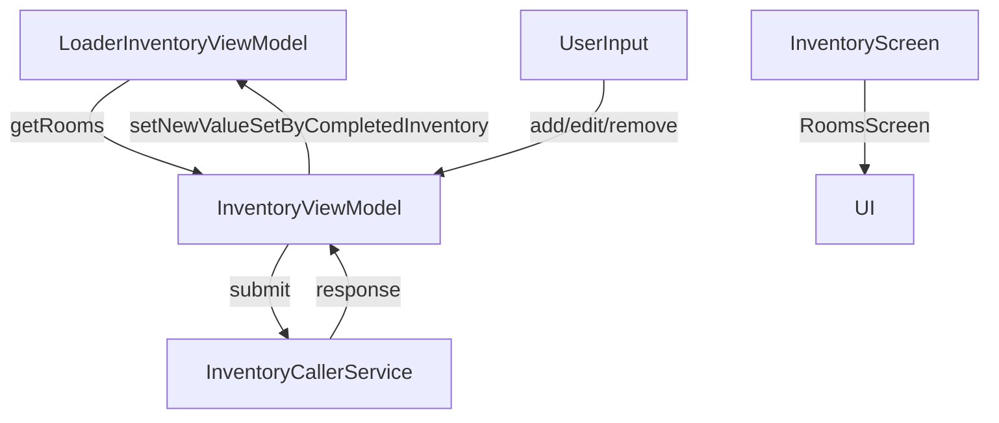

# Inventory Screen

## UI Components

* `LoadingDialog`: Shows loading indicator during inventory loading/sending.
* `ErrorAlert`: Displays errors (room fetch, inventory load, submission).
* `RoomsScreen`: Central UI screen for room listing and editing:

  * Add/Remove/Edit rooms
  * Add furniture to rooms
  * Confirm and submit inventory
  * Navigate to room detail screens

## ViewModel

### `InventoryViewModel`

Handles:

* Inventory state management per session
* Room/furniture API interactions
* Inventory creation (start/end)
* Input validation (check if all rooms/furnitures are completed)

#### Core Methods

* `setPropertyIdAndLeaseId(propertyId, leaseId)`: Initializes screen context.
* `loadInventoryFromRooms(rooms)`: Injects room state from `LoaderInventoryViewModel`.
* `getRooms()`: Exposes current modifiable room list.
* `addRoom(name, roomType, onError)`: Adds a new room via API.
* `removeRoom(roomId)`: Archives a room via API.
* `editRoom(room)`: Updates room state locally.
* `addFurnitureCall(roomId, name, onError)`: Adds new furniture via API.
* `sendInventory(oldReportId, callback)`: Submits completed inventory report.
* `onClose()`: Cleans up state post-submission or screen closure.

#### State Observed

* `inventoryErrors`: API failure status (room load, submission errors, etc.)
* `isLoading`: Tracks inventory request in progress

---

## Functionality

* Triggered by navigation from `LoaderInventoryButton`
* Loads previous inventory if exists
* Displays editable room list (`RoomsScreen`)
* Allows adding furniture, marking items completed, and submitting reports
* Uses `oldReportId` to decide whether it's a start or end inventory

---

## Data Flow

---

## Navigation

* Entry point: `inventory/{propertyId}/{leaseId}`
* On confirm: Pop back to previous screen
* Related detail screens:

  * `roomDetails/RoomDetailsScreen.kt`
  * `roomDetails/OneDetail/OneDetailScreen.kt`
  * `roomDetails/EndRoomDetails/EndRoomDetailsScreen.kt`

---

## API Integration

This screen interacts with:

* [`RoomCallerService`](../../API/Api%20Callers/RoomCallerService.md) — Add/archive rooms
* [`FurnitureCallerService`](../../API/Api%20Callers/FurnituresCallerService.md) — Add furniture items
* [`InventoryCallerService`](../../API/Api%20Callers/InventoryCallerService.md) — Get last report & submit new inventory

---

## Inventory Folder Overview

### Main Screen

* `InventoryScreen.kt` — Initializes inventory session and renders the UI

### State + Logic

* `InventoryViewModel.kt` — Handles inventory lifecycle
* `InventoryTypes.kt` — Data classes: `Room`, `RoomDetail`, `InventoryReportOutput`, enums

### Submodules

#### `loaderButton/`

* [`LoaderInventoryButton`](./loaderButton.md) — Page to see the details of this module
* `LoaderInventoryButton.kt` — Button to launch inventory session
* `LoaderInventoryViewModel.kt` — Loads rooms and last reports, manages loading state

#### `rooms/`

* [`Rooms'](./rooms.md) — Page to see the details of this module
* `RoomsScreen.kt` — Renders full list of rooms with action buttons
* `RoomsViewModel.kt` — Optional separation of room-related logic (if used)

#### `roomDetails/`

* [`RoomsDetails'](./roomDetails/index.md) — Page to see the details of this module
* `RoomDetailsScreen.kt` — Entry for viewing/editing one room’s furnitures
* `RoomDetailsViewModel.kt` — Handles room state changes
* `OneDetailScreen.kt`, `OneDetailViewModel.kt` — Focused view for one item
* `EndRoomDetailsScreen.kt` — View for finalizing/validating details
