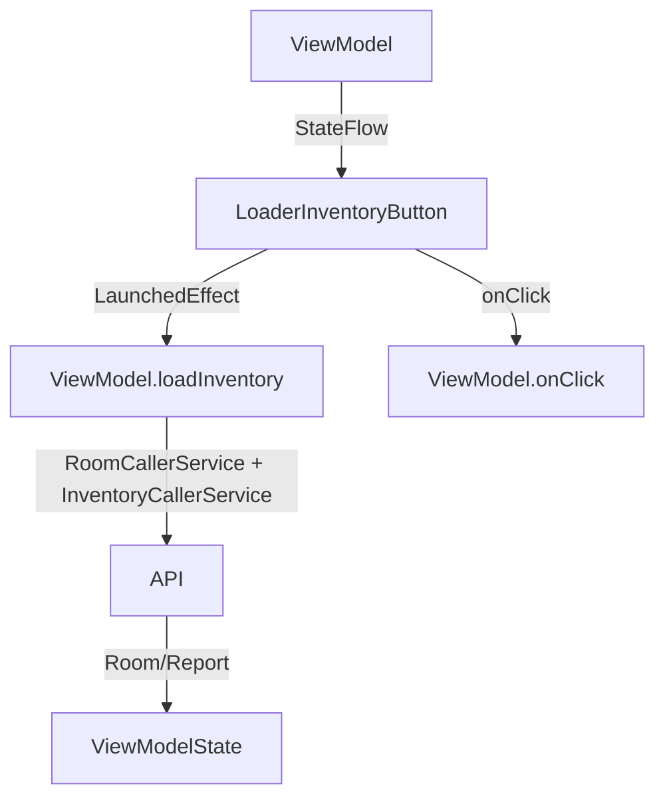

# LoaderInventoryButton

## UI Components

* `LaunchedEffect(propertyId)`: Triggers initial inventory loading when `propertyId` changes.
* `StyledButton`: Custom button component that:

  * Uses localized `inventory_title` text.
  * Displays loading spinner while inventory is loading.
  * Calls `viewModel.onClick()` on press to navigate to inventory screen.

---

## ViewModel

### `LoaderInventoryViewModel`

Manages:

* Room data (fetched from backend)
* Inventory state (including loading, errors, and old report tracking)
* Navigation to the inventory screen

#### Key Functions

* **`loadInventory(propertyId)`**

  * Clears previous rooms.
  * Calls:

    * `getAllRoomsWithFurniture()` via `RoomCallerService`.
    * `getLastInventoryReport()` via `InventoryCallerService`.
  * Attempts to match new rooms with previous inventory state.
  * Handles errors and sets fallback states.

* **`onClick(setIsLoading, propertyId, leaseId)`**

  * Sets loading state and navigates to the inventory screen route.

* **`setNewValueSetByCompletedInventory(newRooms, reportId, context)`**

  * Called when an inventory is completed.
  * Resets room state and sets internal flag to prevent reloading.

* **`getRooms()`**

  * Returns current room list unless a loading process is in progress.

---

### State Observed

* `isLoading`: Whether data is being fetched.
* `oldReportId`: ID of the last inventory report (used to link past state).
* `inventoryErrors`: Tracks API call failures (room fetch, report load, etc.).

### Error Handling

* Custom error model `InventoryApiErrors` tracks:

  * Room fetch failure
  * Inventory report loading failure
  * Room name issues
  * Inventory creation failure

### Internal Tools

* `Mutex`: Ensures safe concurrent access for API calls and state updates.
* `mutableStateListOf<Room>`: Stores the current editable list of rooms.

---

## Functionality

* **Initialization:**

  * When the `propertyId` changes, `loadInventory()` is automatically triggered via `LaunchedEffect`.

* **Inventory Loading Flow:**

  1. Clear room state.
  2. Load base rooms from backend.
  3. Try loading latest inventory report.
  4. Merge previous and new room details.
  5. Update internal state with merged data.

* **User Interaction:**

  * Pressing the button triggers navigation to:

    ```
    inventory/{propertyId}/{leaseId}
    ```

* **ViewModel Lifecycle:**

  * Reset state if inventory is completed and passed back via `setNewValueSetByCompletedInventory`.

---

## Data Flow



---

## Navigation

* On button click → Navigates to `inventory/{propertyId}/{leaseId}` screen

---

## API Integration

This component uses:

* [`RoomCallerService`](../../API/Api%20Callers/RoomCallerService.md)

  * `getAllRoomsWithFurniture(propertyId, onRoomNameError)`
* [`InventoryCallerService`](../../API/Api%20Callers/InventoryCallerService.md)

  * `getLastInventoryReport(propertyId)`

Both extend [`ApiCallerService`](../../API/Api%20Callers/ApiCallerService.md), which:

* Automatically retrieves bearer tokens
* Logs out users on `401`
* Converts Retrofit exceptions into domain-level exceptions

