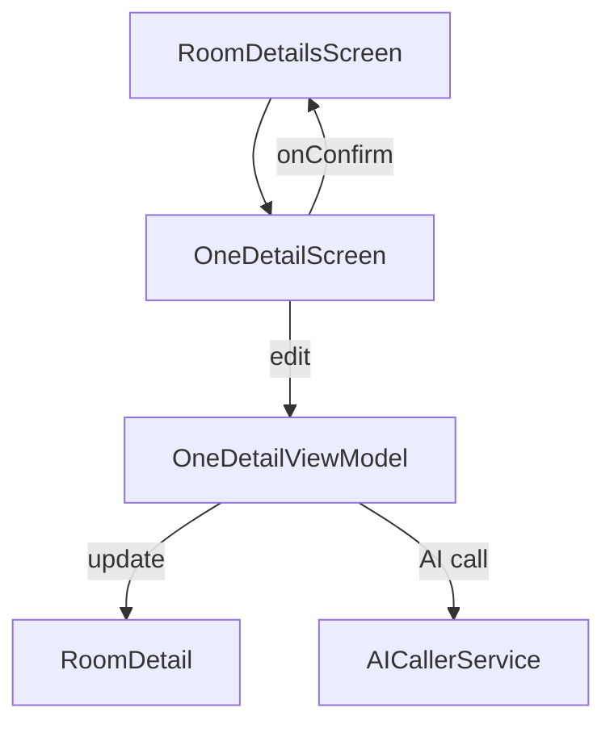

# One Detail Screen

## Purpose

The `OneDetailScreen` is used to **view or edit** a single furniture detail (`RoomDetail`) inside a room, during either **entry** or **exit** inventory phases. It allows adding pictures, describing condition and cleanliness, and optionally calling AI for analysis/comparison.

---

## UI Components

* **`InventoryLayout`**: Base layout wrapper with a common UI structure.
* **`InitialFadeIn`**: Fade-in animation for better user experience.
* **`AddingPicturesCarousel`**:

  * One for new pictures
  * One for entry pictures (shown only on exit inventories)
* **`OutlinedTextField`**: For the comment field.
* **`DropDown`**:

  * One for condition (`State`)
  * One for cleanliness (`Cleanliness`)
* **`ErrorAlert`**: Shows AI call error if applicable.
* **Buttons**:

  * 🔍 `Analyze` / `Compare`: Triggers AI summarization or comparison
  * ✅ `Validate`: Confirms the detail and returns to `RoomDetailsScreen`
* **`LoadingDialog`**: Shows when AI call is in progress

---

## Logic

### Modes

* **Entry Inventory** (`isExit = false`):

  * Only shows picture input once
  * AI performs **summarize**
* **Exit Inventory** (`isExit = true`):

  * Shows old entry pictures (read-only)
  * AI performs **compare** with previous report

### Navigation

* On back press or top-level layout `onClose`, it updates the `RoomDetail` and returns to `RoomDetailsScreen`.

---

## Validation

The following must be set before confirming:

* Name: ≥ 3 characters
* Comment: ≥ 3 characters
* At least 1 picture
* State: not `not_set`
* Cleanliness: not `not_set`

Validation errors are displayed inline using error states in the `RoomDetailsError` model.

---

## ViewModel: `OneDetailViewModel`

### State

* `detail`: Main state for the `RoomDetail` being edited.
* `errors`: Form field validation state (`RoomDetailsError`)
* `aiLoading`: Indicates loading state for AI
* `aiCallError`: Signals if AI call failed
* `picture`: Mutable list of new `Uri` pictures
* `entryPictures`: Entry pictures from previous inventory (for exit comparisons)

### Core Methods

#### Form Control

* `setComment(value)`
* `setCleanliness(cleanliness)`
* `setStatus(status)`
* `addPicture(uri)`
* `removePicture(index)`

#### Navigation

* `onClose(onModifyDetail, isExit)`

  * Updates parent with current data
* `onConfirm(onModifyDetail, isExit)`

  * Validates and submits data

#### AI Integration

* `summarizeOrCompare(...)`

  * Decides whether to call `summarize()` or `compare()` based on context
* `summarize(...)`

  * AI infers detail status from images
* `compare(...)`

  * AI compares exit vs. entry images for differences

---

## Data Flow

---

## AI Call Conditions

* Requires at least 1 picture
* If `oldReportId` is set **and** it's an exit inventory → `compare()`
* Otherwise → `summarize()`
* Updates `RoomDetail` with:

  * `cleanliness`
  * `status`
  * `comment`

---

## Related Concepts

| Element           | Description                                |
| ----------------- | ------------------------------------------ |
| `RoomDetail`      | The individual furniture or element detail |
| `State`           | Enum of possible condition states          |
| `Cleanliness`     | Enum of possible cleanliness states        |
| `AICallerService` | Backend service handling AI summarization  |
| `InventoryLayout` | Shared layout wrapper for inventory UI     |
| `Base64Utils`     | Used to encode images for AI call          |

---

## Related Files in Folder

* `OneDetailScreen.kt` — This UI screen
* `OneDetailViewModel.kt` — The logic and state behind the screen
* `AddingPicturesCarousel.kt` — Carousel for displaying and editing images
* `AICallerService.kt` — API interface for summarize/compare
