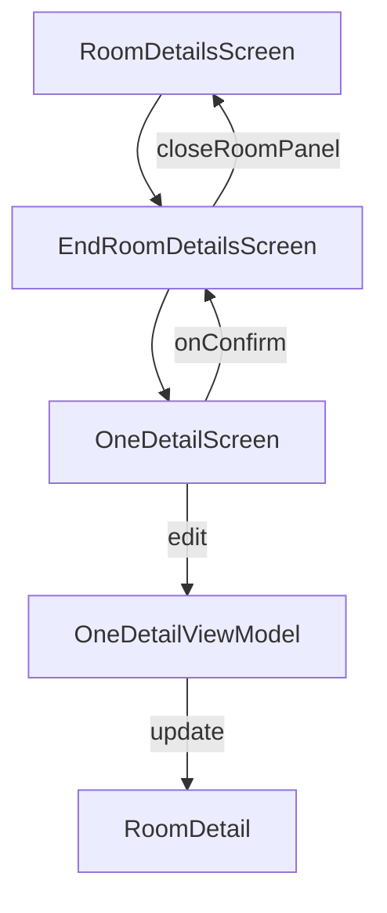

# End Room Details Screen

## Purpose

The `EndRoomDetailsScreen` is used to **finalize and validate a whole room** as a single detail at the end of an inventory process (typically an exit inventory). It wraps around the `OneDetailScreen` to reuse the same UI and logic, but for the entire room instead of individual furniture details.

---

## UI Components

* **`OneDetailScreen`**:
  Used to edit the room as if it were a single detail, leveraging all UI and AI analysis features from `OneDetailScreen`.

---

## Logic

### Visibility

* The screen only renders if `isOpen` is `true`.
* When the user confirms a completed room detail:

  * The room detail is converted back to a `Room`.
  * All existing `newDetails` are attached to the room.
  * The room is passed back to the parent via `closeRoomPanel`.
  * The screen closes via `setOpen(false)`.

---

## Parameters

| Parameter        | Type                | Description                                     |
| ---------------- | ------------------- | ----------------------------------------------- |
| `room`           | `Room`              | The room object being finalized                 |
| `closeRoomPanel` | `(Room) -> Unit`    | Callback to send the finalized room upwards     |
| `oldReportId`    | `String?`           | Previous report ID for AI comparison (optional) |
| `propertyId`     | `String`            | Property identifier for AI and data context     |
| `leaseId`        | `String`            | Lease identifier for AI and data context        |
| `newDetails`     | `Array<RoomDetail>` | Array of completed room details to reattach     |
| `navController`  | `NavController`     | Navigation controller for routing and context   |
| `isOpen`         | `Boolean`           | Controls visibility of this screen              |
| `setOpen`        | `(Boolean) -> Unit` | Setter to open/close this screen                |

---

## Data Flow

---

## Related Concepts

| Element           | Description                                        |
| ----------------- | -------------------------------------------------- |
| `Room`            | The entity representing a room with details        |
| `RoomDetail`      | The entity representing a furniture or room detail |
| `OneDetailScreen` | Reusable screen to edit individual details         |
| `toRoomDetail()`  | Extension to convert `Room` to `RoomDetail`        |
| `toRoom()`        | Extension to convert `RoomDetail` back to `Room`   |

---

## Related Files in Folder

* `EndRoomDetailsScreen.kt` — This screen (UI wrapper for room finalization)
* `OneDetailScreen.kt` — UI for editing one detail or room detail
* `OneDetailViewModel.kt` — Logic and state behind `OneDetailScreen`
