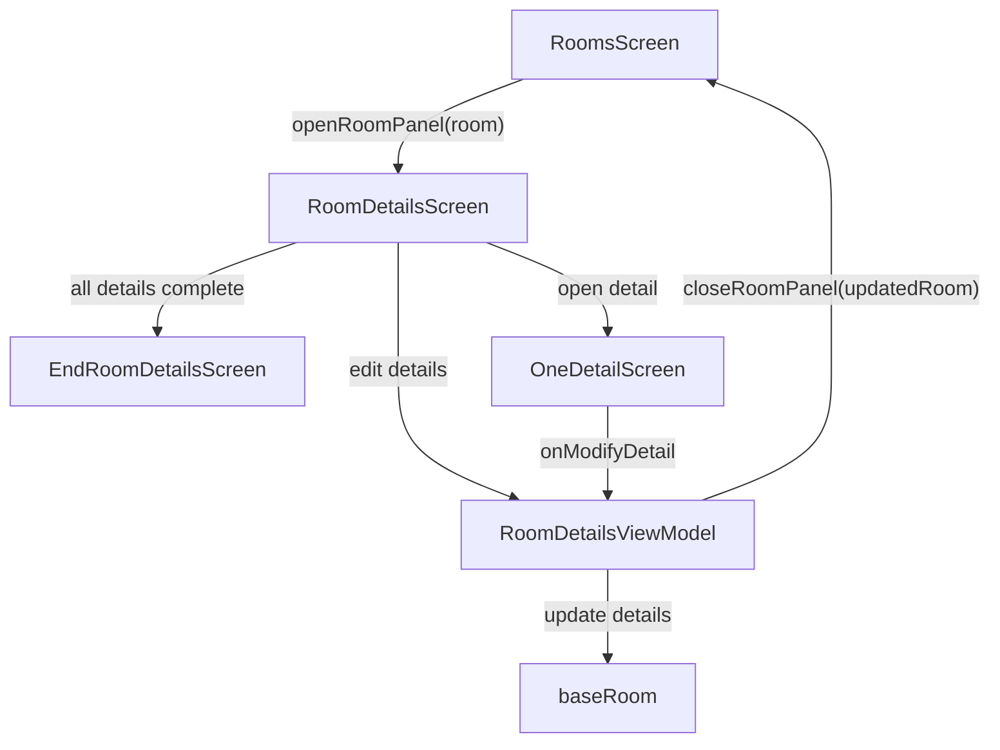

# Room Details Screen

## UI Components

* `InventoryLayout`: Wrapper layout with consistent inventory UI.
* `InitialFadeIn`: Animation for loading screen elements.
* `AddRoomOrDetailModal`: Modal used for adding a new **detail**.
* `EditRoomOrDetailModal`: Modal used for removing an existing detail.
* `LazyColumn`: List of all `RoomDetail` items in the room.
* `NextInventoryButton`: Renders each detail as a button, showing:

  * ✅ if completed
  * ✏️ Edit toggle (inactive in this screen for now)
* `InventoryCenterAddButton`: Appears when edit mode is toggled to add new details.
* Completion Button: Appears when all details are marked complete.
* `OneDetailScreen`: Displayed if a detail is selected for editing.
* `EndRoomDetailsScreen`: Final summary screen for this room, shown once all is completed.

---

## ViewModel

### `RoomDetailsViewModel`

Manages:

* The list of furniture/details in a single room
* Edit states
* Navigation between detail views
* Addition and removal of room details

#### Core Methods

* `addBaseDetails(details: Array<RoomDetail>)`: Loads the initial room details.
* `onClose(room)`: Called when user leaves this screen; updates the parent `Room` with edited details.
* `addDetailToRoomDetailPage(name, roomId)`: Adds a new furniture item to the room.
* `removeDetail(detail)`: Removes a detail locally.
* `onModifyDetail(detail)`: Called when a detail is edited in `OneDetailScreen`.
* `onOpenDetail(detail)`: Sets the selected detail for viewing/editing.
* `handleRemoveDetail(detailId)`: Triggers backend removal and updates local state.

#### State Observed

* `details`: The current working list of `RoomDetail` objects.
* `currentlyOpenDetail`: The detail being actively edited/viewed.

---

## Functionality

* Used inside `RoomsScreen` → when a room is selected.

* Allows user to:

  * Add, remove, and edit room **furniture/details**
  * View/edit each detail individually
  * Validate that all details are completed
  * Proceed to `EndRoomDetailsScreen` if room is complete

* Includes edit mode toggling to expose buttons for detail management.

---

## Data Flow

---

## Completion Logic

* A completion button is shown only if `roomIsCompleted(...) == true`.
* A room is considered complete if **all `RoomDetail` objects have `completed = true`**.

---

## Navigation

* Switches between:

  * Default layout
  * `OneDetailScreen` (furniture edit)
  * `EndRoomDetailsScreen` (summary view)
* Pressing back will call `onClose(baseRoom)` and return to `RoomsScreen`.

---

## API Integration

Uses parent-provided functions:

* `addDetail(roomId, name)`
* `removeDetail(detailId)`
* `closeRoomPanel(updatedRoom: Room)`

All backend operations are passed up and handled via callbacks from the parent `InventoryViewModel`.

---

## Related Files in Folder

### This Screen

* `RoomDetailsScreen.kt` — Displays all details inside a selected room
* `RoomDetailsViewModel.kt` — Logic for manipulating room details

### Child Screens

* `OneDetailScreen.kt` — View/edit one `RoomDetail`
* `EndRoomDetailsScreen.kt` — Final confirmation view of the room
