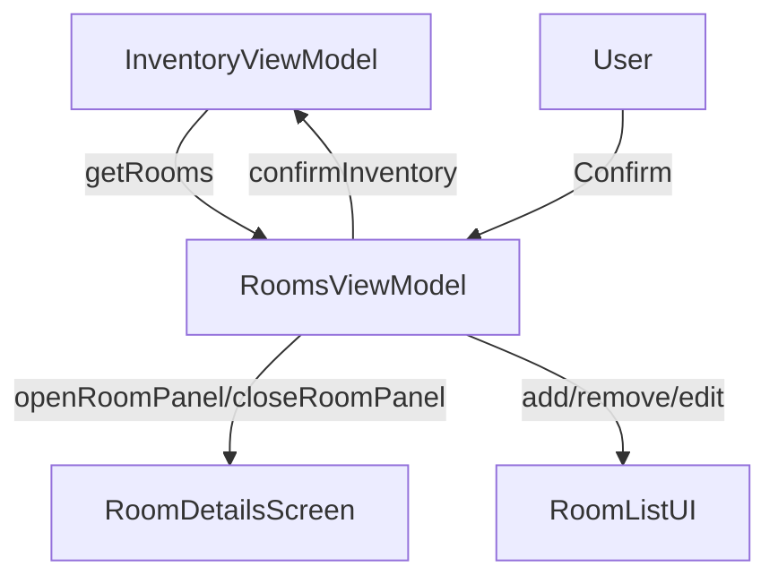

# Rooms Screen

## UI Components

* `InventoryLayout` : Global layout for inventory pages, includes header/back navigation.

* `AlertDialog`: Two modals:

  * **Exit Confirmation**: Warns about unsaved changes.
  * **Inventory Confirmation**: Ensures user confirms completion.

* `AddRoomOrDetailModal`: Modal for adding a new room.

* `EditRoomOrDetailModal`: Modal for editing/removing a room.

* `InitialFadeIn`: Adds entry animation to UI.

* `LazyColumn`: Lists all rooms with `NextInventoryButton`.

* `InventoryCenterAddButton`: Appears during edit mode to add a new room.

* `NextInventoryButton`: Clickable buttons for each room, showing:

  * ✅ Completed status (check icon)
  * ⚠️ Validation errors (if not completed during confirmation)
  * ✏️ Edit toggle (in edit mode)

* `RoomDetailsScreen`: Displayed if a room is currently open for editing.

---

## ViewModel

### `RoomsViewModel`

Handles:

* Room state for the inventory
* Confirmation/exit logic
* Edit toggles and popups
* Opening individual room panels

#### Core Methods

* `handleBaseRooms()`: Loads initial room list from parent `InventoryViewModel`.
* `addARoom(name, type)`: Adds a room to the state and API.
* `openRoomPanel(room)`: Sets selected room for editing.
* `closeRoomPanel(updatedRoom)`: Saves room edits and clears focus.
* `handleRemoveRoom(id)`: Removes a room locally and via API.
* `onConfirmInventory()`: Validates room completion before submission.
* `onClose()`: Cleans up and calls closure handler from parent.

#### State Observed

* `currentlyOpenRoom`: Currently focused room for editing.
* `showNotCompletedRooms`: Flag to indicate validation errors.
* `allRooms`: Internal mutable room list shown in UI.

---

## Functionality

* Used inside `InventoryScreen.kt` to manage and display the current inventory’s rooms.
* Lets the user:

  * Add/Edit/Remove rooms
  * Enter detail screen per room
  * Confirm inventory or exit with confirmation
* Highlights incomplete rooms during confirmation attempt
* Dynamically switches to `RoomDetailsScreen` when one is selected

---

## Data Flow

---

## Navigation

* Navigates to [`RoomDetailsScreen`](./roomDetails/index.md) on room button click
* Returns to list view after `closeRoomPanel()`
* Integrated within the main inventory screen: `/inventory/{propertyId}/{leaseId}`

---

## API Integration

This screen **uses parent callbacks** to interact with backend APIs via:

* `addRoom(name, RoomType)`
* `removeRoom(roomId)`
* `editRoom(room: Room)`
* `confirmInventory()`

Actual API calls are performed in the parent [`InventoryViewModel`](./index.md).

---

## Related Files in Folder

### This Screen

* `RoomsScreen.kt` — Main UI logic for listing and managing rooms
* `RoomsViewModel.kt` — State holder and logic handler for the screen

### Room Detail

* Navigates to [`RoomDetailsScreen`](./roomDetails/index.md) for room content editing
