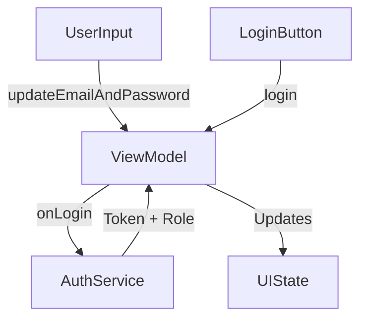

# Login Screen

## UI Components

- `Header`: Displays app logo or name.
- `TopText`: Shows a welcome message and login instruction.
- `OutlinedTextField`: Email input field (`KeyboardType.Email`), with error message support.
- `PasswordInput`: Password field with error message and visibility toggle.
- `CheckBoxWithLabel`: "Keep me signed in" option.
- Clickable `Text`: 
  - "Forgot Password" navigates to password recovery.
  - "Sign Up" navigates to the registration page.
- `Button`: Triggers login process.
- `ErrorAlert`: Displays API error codes if present.
- `LoadingDialog`: Shown during login API call.

## ViewModel

**`LoginViewModel`** handles:

- `LoginState`: `email`, `password`, `keepSigned`.
- `LoginErrorState`: `email`, `password`, `apiError`.
- `updateEmailAndPassword(email, password, keepSigned)`: Updates user input.
- `login(setIsOwner)`: Validates inputs and initiates login flow.
- Uses `Mutex` to avoid concurrent login requests.
- Handles login success/failure with UI state updates and navigation.

### State Observed

- `emailAndPassword`: Combined state for inputs.
- `errors`: Email/password validation or API error.
- `isLoading`: Indicates progress during login.

## Functionality

- Validates:
  - Email format (`RegexUtils.isValidEmail`)
  - Password minimum length (≥ 3)
- Calls [`AuthService.onLogin`](#authservice) to authenticate.
- Stores session token via `DataStore` if login succeeds.
- Sets user ownership role via `setIsOwner(authService.isUserOwner())`.
- Navigates to dashboard on success.
- Parses error response and displays appropriate error messages.

## Data Flow

## Navigation

* "Forgot Password" → `forgotPassword` screen
* "Sign Up" → `register` screen
* On success → `dashboard` screen

## API Integration

This screen relies on the [`AuthService`](../API/AuthService.md) class for handling the login API call and user role verification.

### AuthService

* Handles actual API login request and token persistence.
* Injected through the `apiService` and `context.dataStore`.
