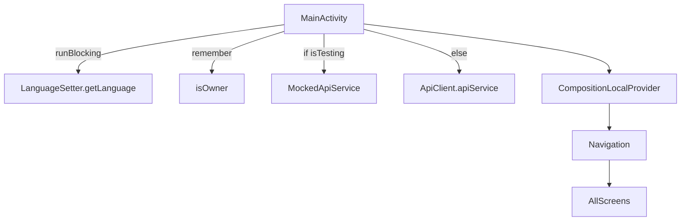

# MainActivity

## Overview

`MainActivity` is the **entry point** of the application. It configures localization, theming, and app-wide dependencies, then loads the **Composable navigation structure** via `Navigation()` inside a themed environment.

---

## UI Components

* **`AppTheme`**:
  Wraps all UI content with the app's custom Material3 design system.

* **`CompositionLocalProvider`**:
  Provides global dependencies (e.g. API service, owner role state) to all children composables:

  * `LocalApiService`: Provides either a real or mocked `ApiService`.
  * `LocalIsOwner`: Mutable boolean state to indicate if the user is the property owner.

* **`Box` with `safeDrawingPadding`**:
  Provides a fullscreen layout that respects system insets (e.g., notches) and sets a background color from the current theme.

* **`Navigation()`**:
  Root-level Composable that handles routing between screens.

---

## Lifecycle Setup

* Executed in `onCreate()`:

  1. **Language Setup**:

     * Uses [`LanguageSetter`](../utilities/utils%20folder/languageSetter.md) with `DataStore` to retrieve saved language setting.
     * Applies locale to system configuration using `Locale.setDefault(...)` and `Configuration.setLocale(...)`.

  2. **API Selection**:

     * Uses real or mocked `ApiService` based on global `isTesting` flag.

  3. **State Initialization**:

     * Initializes `MutableState<Boolean>` for `isOwner`, which is used across the app to control owner-specific features.

---

## Globals and CompositionLocals

### `LocalApiService`

```kotlin
val LocalApiService = compositionLocalOf<ApiService> {
    error("ApiService not provided")
}
```

Used to provide the [`ApiService`](../API/ApiClient/ApiClientAndService.md) (mocked or real) throughout the app. Accessed with:

```kotlin
val apiService = LocalApiService.current
```

---

### `LocalIsOwner`

```kotlin
val LocalIsOwner = compositionLocalOf<MutableState<Boolean>> {
    error("No local is owner provided")
}
```

Global state representing whether the current user is the property owner. Influences conditional logic in several screens (e.g., edit/delete permissions).

---

### `isTesting`

```kotlin
var isTesting = false
```

Flag used to switch between **mocked** and **real API behavior**. Useful for UI tests and offline development.

---

## Data Flow



---

## Localization

* Dynamically sets language and layout direction before Composables are composed.
* Reads language preference from `DataStore` (via [`LanguageSetter`](../utilities/utils%20folder/languageSetter.md)).
* Applies locale to both `Locale.setDefault()` and `Configuration`.

---

## Navigation

* [`navigation`](../utilities/navigation.md) - Page for the navigation
* Root `Navigation()` Composable handles route management.
* All screens launched from here can access `LocalApiService` and `LocalIsOwner`.

---

## Testing Support

* Toggle `isTesting = true` to force `MockedApiService` usage.
* Useful for previewing UI without requiring a backend or login session.

---

## Summary

MainActivity is responsible for:

✅ Initializing language and locale
✅ Setting up API client (real or mock)
✅ Providing owner status to Composables
✅ Bootstrapping the navigation and UI stack inside `AppTheme`

