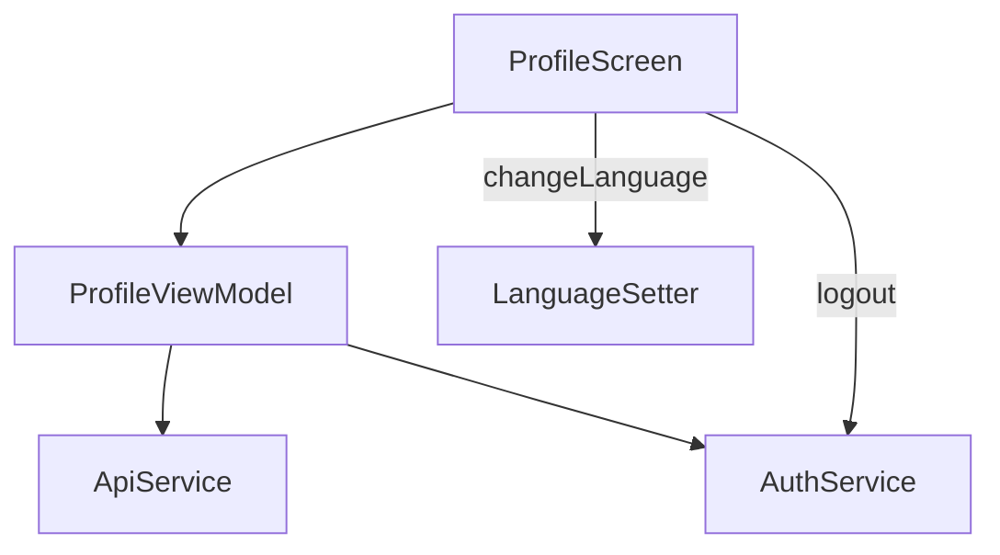

# Profile Screen

## Purpose

The `ProfileScreen` provides a user interface to **view user profile information**, **change app language**, and **log out** of the application. It displays user data retrieved from the backend and allows switching between English and French with an app restart.

---

## UI Components

* **`DashBoardLayout`**:
  Base layout providing consistent dashboard styling and navigation handling.

* **`LoadingDialog`**:
  Displays a loading spinner overlay while profile data is being fetched.

* **`ErrorAlert`**:
  Shows an error message if fetching profile data fails.

* **User Info Section** (`UserInfoLine` inside `LineBottomColumn`):

  * Displays first name, last name, and email with labels and values.

* **Language Selector**:

  * `SingleChoiceSegmentedButtonRow` with options "English" and "Français"
  * Changes app language and restarts app on selection.

* **Logout Section**:

  * Icon button with logout icon
  * Triggers logout operation

---

## Logic

### Initialization

* On first load (`LaunchedEffect(Unit)`), calls `initProfile()` to fetch user info from backend.

### Language Selection

* Detects system default language; defaults segmented control selection accordingly.
* Changing language calls `changeLanguageAndRestart()` in `ProfileViewModel` to:

  * Persist selected language in local datastore.
  * Restart app to apply language changes.

### Logout

* Calls `logout()` in `ProfileViewModel` which triggers auth service to clear session and navigate away.

---

## State and Data Flow

| State Variable | Description                              |
| -------------- | ---------------------------------------- |
| `infos`        | User profile info (`ProfileState`)       |
| `isLoading`    | Loading indicator state                  |
| `apiError`     | Indicates if API call for profile failed |

---

## ViewModel: `ProfileViewModel`

### State

* `_infos` holds current user profile info.
* `_isLoading` indicates ongoing API calls.
* `_apiError` signals API call failures.

### Core Methods

* `initProfile()`
  Fetches profile data from backend.

* `logout()`
  Calls auth service to logout and navigate.

* `changeLanguageAndRestart(context, language)`
  Sets new language in local datastore, then restarts app to apply.

---

## UI Helpers

### `UserInfoLine(label, value)`

Displays a label in thin font with a corresponding value below it.

### `LineBottomColumn(content)`

Wraps content with a bottom border line and vertical padding for separation.

---

## Data Flow

---

## Related Concepts

| Element                | Description                           |
| ---------------------- | ------------------------------------- |
| `ProfileState`         | Data class holding user info          |
| `ApiService`           | Network API interface                 |
| `ProfileCallerService` | Handles API calls related to profile  |
| `AuthService`          | Authentication and logout service     |
| `LanguageSetter`       | Manages storing and applying language |
| `DashBoardLayout`      | Common app dashboard layout wrapper   |

---

## Related Files in Folder

* `ProfileScreen.kt` — UI components and screen composable
* `ProfileViewModel.kt` — ViewModel managing profile data and actions
* `ProfileCallerService.kt` — Backend API call logic for profile
* `AuthService.kt` — Auth and logout management

