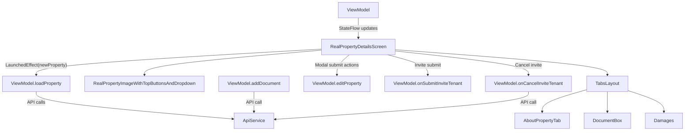

# RealPropertyDetailsScreen

## UI Components

* `RealPropertyImageWithTopButtonsAndDropdown`

  * Displays property image with rounded corners.
  * Shows back button (if provided).
  * Owner-only “more options” dropdown with actions:

    * Add Tenant (invite)
    * End Lease
    * Cancel Invitation
    * Edit Property
    * Delete Property

* `TabsLayout`

  * Manages three tabs: About, Documents, Damages.
  * Displays appropriate tab content based on selected tab index.

* `AboutPropertyTab`

  * Shows property stats: area, rent per month, deposit.
  * Shows tenant or invitation info and relevant lease/invite dates.
  * Owner with active lease sees the `LoaderInventoryButton` to manage inventory.

* `DocumentBox`

  * Lists documents as clickable icons.
  * Enables adding PDFs via Android file picker.

* `Damages`

  * Shows list of reported damages with images and comments.
  * Allows non-owners to add damage reports.

* Modals:

  * `AddOrEditPropertyModal` for editing property details.
  * `InviteTenantModal` for inviting tenants.

---

## ViewModel

### `RealPropertyDetailsViewModel`

Manages:

* Current property state (`DetailedProperty`)
* Document list for the property
* Damage reports for the property
* API error states (`GET_PROPERTY`, `UPDATE_PROPERTY`, `NONE`)
* Loading state for asynchronous operations
* Tenant invitations

#### Key Functions

* **`loadProperty(newProperty: DetailedProperty)`**

  * Sets initial property data.
  * Fetches associated documents and damages if lease ID is available.
  * Updates `documents` and `damages` lists.
  * Handles errors and manages loading state.

* **`editProperty(propertyEdited: AddPropertyInput, propertyId: String)`**

  * Sends edited property data to API.
  * Updates local property state on success.
  * Manages loading and error states.

* **`onSubmitPicture(picture: String)`**

  * Decodes base64 picture string.
  * Updates property image state.

* **`openPdf(documentId: String, context: Context)`**

  * Finds document by ID.
  * Decodes base64 PDF data and opens file using external PDF viewer.

* **`addDocument(documentUri: Uri, context: Context)`**

  * Converts selected PDF URI to base64.
  * Uploads new document to API.
  * Updates document list.

* **`onSubmitInviteTenant(email: String, startDate: Long, endDate: Long)`**

  * Creates a new tenant invitation.
  * Updates property status accordingly.

* **`onCancelInviteTenant()`**

  * Cancels tenant invitation via API.
  * Updates property status and invite info.

* **`addDamage(damage: Damage)`**

  * Adds new damage report locally.

---

## State Observed

* `property`: Current detailed property state.
* `documents`: List of uploaded documents.
* `damages`: List of damages reported.
* `apiError`: Tracks current API error state.
* `isLoading`: Loading state for all async operations.

---

## Error Handling

* `ApiErrors` enum tracks error types:

  * `GET_PROPERTY`: Error loading property data.
  * `UPDATE_PROPERTY`: Error editing property or canceling invite.
  * `NONE`: No error.

* Displays localized error messages on screen accordingly.

---

## Functionality

* **Initialization:**

  * Property details and related data are loaded on screen entry or when `newProperty` changes.
  * Modals and dropdown menus provide interactive editing and tenant management.

* **Tabs Interaction:**

  * Switching tabs updates visible content.
  * Documents tab allows PDF additions with file picker.
  * Damages tab allows reporting claims (only for non-owners).

* **Owner Actions:**

  * Can invite tenants if property is available.
  * Can end lease if property is unavailable.
  * Can cancel tenant invitation if status is `invite_sent`.
  * Can edit or delete property.

* **Tenant/Lease Info:**

  * Tenant or invite email shown.
  * Lease or invitation dates formatted for display.

---

## Data Flow

---

## Navigation

* Back button triggers callback `getBack` passing current property state.
* Modals open/close locally via `rememberSaveable` states.
* No direct navigation to other screens in this component except via the LoaderInventoryButton in About tab.

---

## API Integration

* Uses multiple caller services extending `ApiCallerService`:

  * `RealPropertyCallerService` (property, documents)
  * `DamageCallerService` (damages)
  * `InviteTenantCallerService` (tenant invitations)

* Caller services handle:

  * Bearer token injection
  * Error translation
  * User logout on `401`

---

➡️ See [RealPropertyDetailsViewModel.kt](#)
➡️ See [RealPropertyCallerService.kt](#)
➡️ See [DamageCallerService.kt](#)
➡️ See [InviteTenantCallerService.kt](#)
