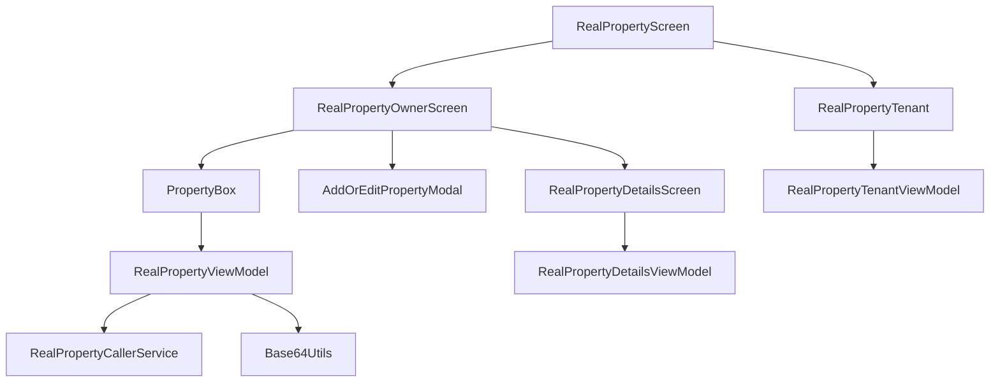

# Real Property Module

## UI Components

* `RealPropertyScreen`: Entry point composable that switches view based on user role (owner or tenant).
* `RealPropertyOwnerScreen`: Displays owned properties with add/delete capabilities and details navigation.
* `PropertyBox`: UI card for showing property image, name, address, and status with clickable and long-press gestures.
* `PropertyStatusBox`: Visual indicator of property availability status with colored background.
* `AddOrEditPropertyModal`: Modal dialog for creating or editing a property.
* `RealPropertyDetailsScreen` (in `details/` folder): Detailed property view, with tabs for about, damages, and documents.
* `RealPropertyTenant`: Tenant-specific property UI.

---

## ViewModel

### `RealPropertyViewModel`

Handles:

* Loading and managing the list of properties.
* API calls to fetch, add, delete, and update properties.
* Loading and caching property images asynchronously.
* Managing UI states: loading, API errors, selected property details.
* Synchronizing property list updates with a mutex for thread safety.

#### Core Methods

* `getProperties()`: Fetches all properties and associated images from API.
* `addProperty(propertyForm)`: Adds a new property through API and updates local list.
* `deleteProperty(propertyId)`: Archives (deletes) a property and updates the list.
* `setPropertySelectedDetails(propertyId)`: Sets a property as selected for detail view.
* `getBackFromDetails(modifiedProperty)`: Updates a property in the list after detail editing.
* `setPropertyImage(propertyId, image)`: Updates the image of a property in the local list.
* `closeError()`: Resets API error state.

#### State Observed

* `properties`: Current list of properties (`DetailedProperty`).
* `propertySelectedDetails`: Currently selected detailed property.
* `isLoading`: Indicates ongoing API calls.
* `apiError`: Tracks type of API error encountered (`GET_PROPERTIES`, `ADD_PROPERTY`, `DELETE_PROPERTY`, or `NONE`).

---

## Functionality

* Supports property listing with image, status, and address display.
* Enables adding new properties through modal UI.
* Allows property deletion by long-press on property card.
* Handles property selection to show detailed property view.
* Provides seamless switching between owner and tenant UI.
* Uses local state and API integration to keep property list current.

---

## Data Flow

---

## Navigation

* Entry point: `realPropertyScreen`
* Owner view:

  * List properties → Add new property (modal) → Select property → Detail screen
  * Long press property → Delete confirmation popup
* Tenant view:

  * Tenant-specific property overview
* Back from details updates property list and closes detail screen

---

## API Integration

This module interacts with:

* `RealPropertyCallerService` — Fetches, adds, deletes, and archives properties.
* `Base64Utils` — Decodes Base64 image strings to images for display.
* `AddOrEditPropertyModal` — UI for property creation/updating.
* `RealPropertyDetailsViewModel` — Manages detailed property data and interactions.

---

## Real Property Folder Overview

### Main Screens

* `RealPropertyScreen.kt` — Entry point deciding owner vs tenant UI
* `RealPropertyOwnerScreen` (in `RealPropertyScreen.kt`) — Owner’s main property listing and management screen
* `RealPropertyTenant.kt` — Tenant property overview UI

### State + Logic

* `RealPropertyViewModel.kt` — Manages property list state, API calls, selection, and error handling
* `details/RealPropertyDetailsViewModel.kt` — Handles property detail screen logic and state

### Detail Screen

* `details/RealPropertyDetails.kt` — Detailed property info UI with tabs
* `details/tabs/` — Tabs for property about, damages, and documents

### Tenant

* `tenant/RealPropertyTenant.kt` — Tenant-specific UI
* `tenant/RealPropertyTenantViewModel.kt` — Tenant data management
