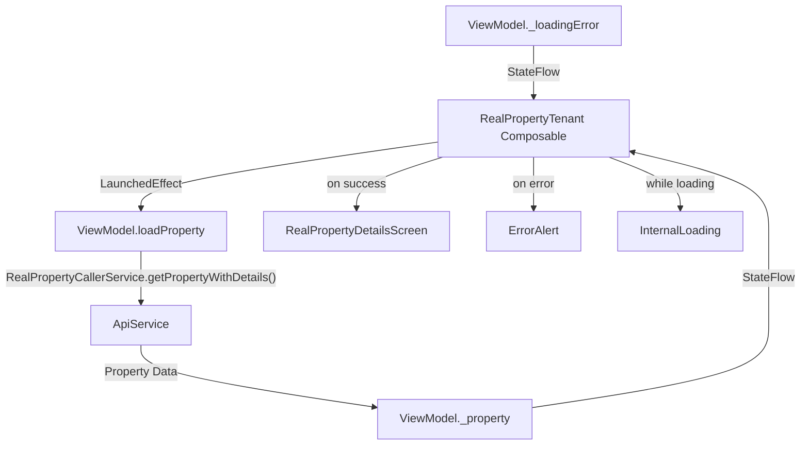

# RealPropertyTenant

## UI Components

* `RealPropertyTenant` Composable

  * Uses `LocalApiService` to access API layer.

  * Instantiates `RealPropertyTenantViewModel` scoped to composable lifecycle.

  * Observes:

    * `property`: The detailed property info.
    * `isLoading`: Loading state flag.
    * `loadingError`: Error state holding a resource ID for error message.

  * `LaunchedEffect(Unit)` triggers initial property loading when the composable enters composition.

  * Uses `DashBoardLayout` wrapper for consistent app layout and navigation handling.

  * Displays content conditionally:

    * If property data is loaded and not loading:
      Shows `RealPropertyDetailsScreen` with loaded property and passes `loaderInventoryViewModel` for inventory features.

    * If loading failed and not loading:
      Shows `ErrorAlert` with localized error message.

    * Otherwise (loading in progress):
      Shows `InternalLoading` spinner.

---

## ViewModel

### `RealPropertyTenantViewModel`

Manages:

* Property data of type `DetailedProperty?`
* Loading state for async API calls
* Loading error state with optional localized error resource ID

#### Key Functions

* **`loadProperty()`**

  * Clears existing error state.
  * Sets loading flag to true.
  * Attempts to fetch detailed property data from API via `RealPropertyCallerService.getPropertyWithDetails()`.
  * Updates property state on success.
  * Updates error state with API error code on `ApiCallerServiceException`.
  * Logs and ignores unexpected exceptions.
  * Resets loading flag after operation completes.

---

## State Observed

* `property: StateFlow<DetailedProperty?>` — currently loaded property or `null` if not loaded.
* `isLoading: StateFlow<Boolean>` — indicates whether data loading is in progress.
* `loadingError: StateFlow<Int?>` — resource ID for error message to display or `null` if no error.

---

## Error Handling

* Catches domain-specific `ApiCallerServiceException` to retrieve error codes for user-friendly messages.
* Fallbacks to console logging for unexpected exceptions.
* Shows error alerts with localized messages using resource IDs.

---

## Functionality

* **Initial Load:**

  * Automatically loads the detailed property once the composable is composed.
  * Uses Kotlin coroutines inside `viewModelScope` to perform API call asynchronously.
* **UI Reaction:**

  * On successful load, delegates display to `RealPropertyDetailsScreen` (which manages tabs, editing, tenant invites, etc.).
  * On error, shows an error alert message.
  * While loading, shows a spinner.

---

## Data Flow

---

## Navigation

* Uses `NavController` mainly to instantiate [`RealPropertyCallerService`](../../API/Api%20Callers/RealPropertyCallerService.md) for API calls.
* Delegates actual property details screen navigation and back handling to nested `RealPropertyDetailsScreen`.

---

## API Integration

* Relies on [`RealPropertyCallerService`](../../API/Api%20Callers/RealPropertyCallerService.md) for fetching detailed property data.

  * `getPropertyWithDetails()`: Fetches property and associated detailed info from backend.

* [`RealPropertyCallerService`](../../API/Api%20Callers/RealPropertyCallerService.md) extends [`ApiCallerService`](../../API/Api%20Callers/ApiCallerService.md) and manages:

  * Authorization headers.
  * Error handling and user logout on unauthorized.
  * Exception translation.

