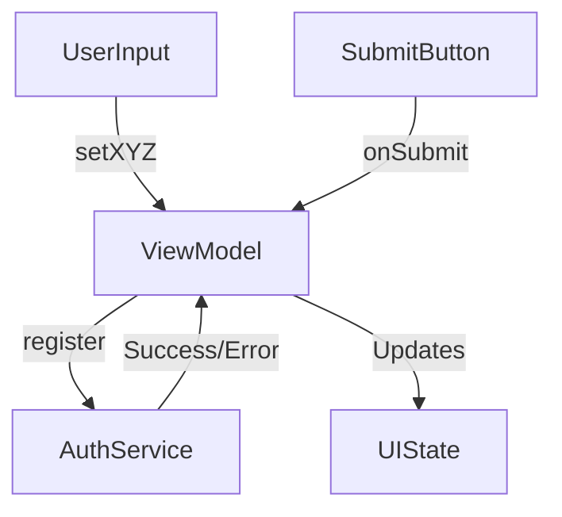

# Register Screen

## UI Components

- `Header`: Displays app logo or name.
- `TopText`: Shows a title and registration instruction.
- `OutlinedTextField`s:
  - `lastName`, `firstName`: Standard text inputs with validation.
  - `email`: Email input (`KeyboardType.Email`) with format validation.
- `PasswordInput`s:
  - Main password input with visibility toggle.
  - Password confirmation input with validation against original password.
- `CheckBoxWithLabel`: "Agree to terms and conditions".
- `ErrorAlert`: Displays backend error messages.
- `Button`: Triggers registration process.
- Clickable `Text`: Navigates to login screen if the user already has an account.

## ViewModel

**`RegisterViewModel`** manages:

- `RegistrationInput`: `firstName`, `lastName`, `email`, `password`.
- `RegisterConfirm`: `confirmPassword`, `agreeToTerms`.
- `RegisterFormError`: Field-level validation and API errors.

### Functions

- `setFirstName`, `setLastName`, `setEmail`, `setPassword`, `setConfirmPassword`, `setAgreeToTerms`: Update form state.
- `onSubmit()`: Validates all fields, then triggers registration.
- `registerToApi()`: Calls [`AuthService.register`](#authservice), clears form state on success.

## Functionality

- Validates:
  - `firstName`/`lastName`: Must be between 3 and 30 characters.
  - `email`: Must match valid email format.
  - `password`: Minimum 8 characters.
  - `confirmPassword`: Must match password.
  - `agreeToTerms`: Must be checked.
- On successful validation, sends form to API.
- On registration success, navigates to login screen and resets state.
- On failure, shows appropriate error messages.

## Data Flow

## Navigation

* On success → `login` screen.
* Back gesture → `login` screen.
* "Already have an account?" → `login` screen.

## API Integration

This screen relies on the [`AuthService`](../API/AuthService.md) class for handling the registration API call.

### AuthService

Handles registration and token management.

➡️ See [AuthService.kt](#) *(link to actual file in your repo or docs)*

