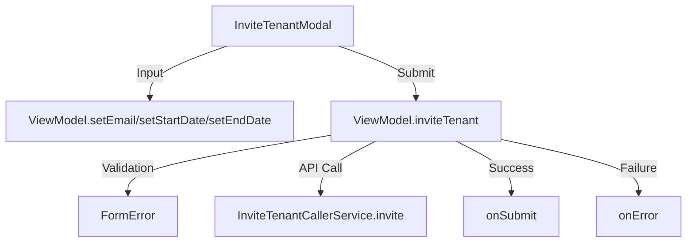

# InviteTenantModal

## UI Components

* **`BigModalLayout`**  
  Full-screen modal layout that wraps all invitation inputs and actions.

* **`Text` (Title)**  
  Displays "Invite Tenant" as a header.

* **`OutlinedTextField`**  
  Input field for tenant email with inline validation and test tag `"tenantEmail"`.

* **`DateRangeInput`** (twice)  
  - Start date selector  
  - End date selector  
  Both fields share date validation error messaging and unique test tags:  
  `"startDateInput"` and `"endDateInput"`.

* **`StyledButton`**  
  Submits the invitation using the `inviteTenant` function.  
  Test tag: `"sendInvitation"`.

---

## ViewModel

### `InviteTenantViewModel`

Handles:

* Invitation form state (`InviteTenantInputForm`)
* Validation state (`InviteTenantInputFormError`)
* API submission through `InviteTenantCallerService`

#### State

* `invitationForm`: Holds email, start date, and end date.
* `invitationFormError`: Tracks email and date validation errors.

#### Key Functions

* **`setEmail(email: String)`**  
  Updates the tenant's email in the form state.

* **`setStartDate(date: Long)`**, **`setEndDate(date: Long)`**  
  Updates the selected start/end lease dates.

* **`reset()`**  
  Resets form and validation state.

* **`inviteTenant(...)`**
  1. Validates email format using `RegexUtils`.
  2. Ensures `startDate` is before `endDate`.
  3. Calls `InviteTenantCallerService.invite(...)`.
  4. Triggers `onSubmit(email, startDate, endDate)` after success.
  5. Manages `setIsLoading` state and error handling via `onError`.

---

## Validation Logic

* Email:
  - Must be valid as per `RegexUtils.isValidEmail()`

* Date:
  - `startDate` must be earlier than `endDate`

Errors are reflected in the UI using `formError`.

---

## Data Flow



---

## API Integration

* Uses **`InviteTenantCallerService`** to perform backend invitation via:

```kotlin
invite(propertyId: String, input: InviteInput)
```

* Internally converts form to `InviteInput` using:

```kotlin
InviteTenantInputForm.toInviteInput()
```

which uses ISO 8601 date formatting via `SimpleDateFormat`.

---

## Lifecycle and Effects

* ViewModel is scoped to the Composable.
* Automatically resets state after successful invitation or modal close.

---

➡️ See [InviteTenantCallerService.kt](#)
➡️ See [RegexUtils.kt](#)
➡️ See [InviteInput.kt](#)
