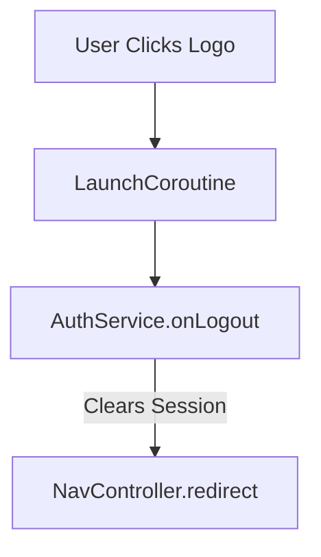

# LoggedTopBar

---

## UI Component

### `LoggedTopBar`

* Displays the top app bar for authenticated users.
* Includes the app logo and name.
* Allows logout on logo click.
* Uses theming and test tags for styling and testing.

---

## Parameters

* `navController: NavController`
  Navigation controller used to redirect after logout.

---

## Behavior

* **Logo Click**:
  When the user taps the logo (`Image`), the app:

  1. Launches a coroutine inside the `LoggedTopBarViewModel`.
  2. Calls the `AuthService.onLogout(...)` method with `dataStore` and `apiService`.
  3. Redirects the user post-logout using the `NavController`.

---

## ViewModel

### `LoggedTopBarViewModel`

* Empty `ViewModel` used solely to host `viewModelScope` for coroutine launching.
* Scoped to the composable via `viewModel()`.

---

## Usage Flow

---

## Notes

* Ensures separation of concerns: logout logic stays in `AuthService`.
* Minimal ViewModel used just for lifecycle-safe coroutine management.
* Designed for reuse across authenticated screens.
