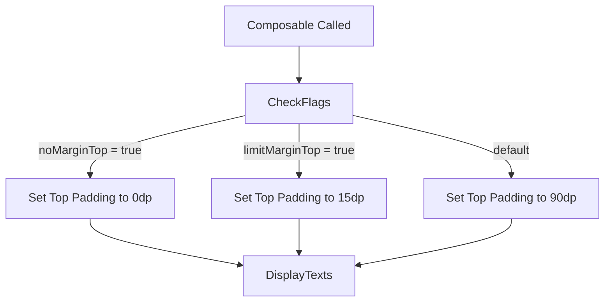

# TopText

---

## UI Component

### `TopText`

* Displays a centered title and subtitle vertically.
* Offers configurable top margin behavior through optional flags.
* Styled using MaterialTheme for consistent theming across the app.

---

## Parameters

* `title: String`
  The main title text to display at the top of the screen. Rendered in large, semi-bold font.

* `subtitle: String`
  Secondary supporting text shown under the title. Rendered in smaller font.

* `limitMarginTop: Boolean = false`
  If `true`, reduces the top margin to 15.dp instead of the default 90.dp. Useful for subpages or less spacing.

* `noMarginTop: Boolean = false`
  If `true`, removes the top margin entirely (`0.dp`). Has priority over `limitMarginTop`.

---

## Behavior

* **Top Margin Logic**:
  The `Column` containing the texts adapts its top padding based on the following priority:

  1. If `noMarginTop` is `true`, padding is `0.dp`.
  2. Else if `limitMarginTop` is `true`, padding is `15.dp`.
  3. Otherwise, default padding is `90.dp`.

* **Text Styling**:

  * `title`: 30.sp, `FontWeight.SemiBold`, primary color.
  * `subtitle`: 15.sp, primary color.

---

## Usage Flow

---

## Notes

* Useful for creating consistent page headers across different screens.
* Can be reused in both full-screen and modal layouts.
* Prioritizes readability and visual hierarchy through spacing and typography.
