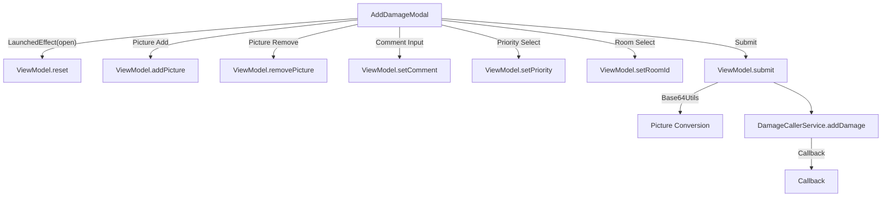

# AddDamageModal

## UI Components

* **`BigModalLayout`**  
  Fullscreen modal wrapper for damage reporting.

* **`AddingPicturesCarousel`**  
  Lets users add and remove pictures with UI feedback on error.

* **`OutlinedTextField`**  
  Input for user comments on damage, with live error state.

* **`DropDown`** (Priority)  
  Allows users to choose damage severity from: Low, Medium, High, Urgent.

* **`DropDown`** (Room)  
  Lists all current rooms fetched from API.  
  Selection is required to submit.

* **`StyledButton`**  
  Submits the form and triggers the `addDamage()` callback if valid.

---

## ViewModel

### `AddDamageModalViewModel`

Manages:

* Form state (`DamageInput`)
* Form validation flags
* Pictures as `Uri`
* Room list fetched from backend

#### Key Functions

* **`reset()`**
  * Clears form, errors, pictures, and reloads room list.

* **`setComment(String)`**
  * Updates comment field and clears its error state.

* **`setPriority(DamagePriority)`**
  * Updates selected damage priority.

* **`setRoomId(String)`**
  * Updates selected room and clears room error.

* **`addPicture(Uri)` / `removePicture(index)`**
  * Add/remove images to be uploaded as base64 strings.

* **`submit(addDamage, tenantName)`**
  * Validates form.
  * Converts images to Base64.
  * Calls backend to create damage and triggers callback.

#### Error Handling

* `DamageInputError` tracks:
  * Empty comment
  * Missing picture(s)
  * Unselected room

* `checkBeforeSubmit()` sets these flags and prevents invalid submissions.

---

## Functionality

* **Initialization**  
  When modal opens, the form and pictures are reset, and rooms are fetched via `getAllRooms("current")`.

* **Image Conversion**  
  Images are encoded with `Base64Utils.encodeImageToBase64(...)`.

* **Submission Flow**:
  1. Validate form.
  2. Convert pictures.
  3. Submit to backend via `DamageCallerService.addDamage(...)`.
  4. Transform data to `Damage` with ID and room name.
  5. Call external `addDamage(...)` handler.
  6. Reset form.

---

## State Observed

* `form`: Holds user input (`comment`, `priority`, `room_id`, etc.)
* `formError`: Field-level validation state.
* `pictures`: Mutable list of user-selected `Uri`s.
* `rooms`: Mutable list of rooms fetched from API.

---

## Data Flow

