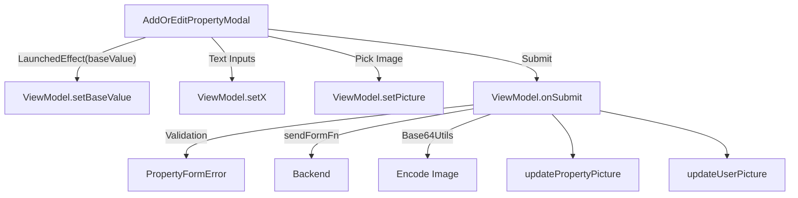

# AddOrEditPropertyModal

## UI Components

* **`BigModalLayout`**  
  A large scrollable modal that wraps the entire add/edit form.

* **`OutlinedTextField`** (Multiple Fields)  
  Text inputs for:
  - Property name  
  - Address  
  - Apartment number  
  - City  
  - Postal code  
  - Country  
  - Area (sqm)  
  - Rental price  
  - Deposit price  
  Each input includes validation and test tags.

* **`Button` (Add Picture)**  
  Opens Android system photo picker via `ActivityResultContracts.PickVisualMedia`.  
  Selected image preview is shown via `AsyncImage`.

* **`Button` (Submit)**  
  Submits the form to the backend and optionally uploads the property picture.

* **`Row` (Header)**  
  Displays the title (e.g. “Add Property”) and a close icon.

---

## ViewModel

### `AddOrEditPropertyViewModel`

Manages:

* Property form state (`AddPropertyInput`)
* Validation flags (`PropertyFormError`)
* Selected image (`Uri`)

#### Key Functions

* **`setBaseValue(AddPropertyInput)`**  
  Preloads form with existing property data for editing mode.

* **Field setters** (`setName`, `setAddress`, `setRental`, etc.)  
  Update individual fields of the form.

* **`setPicture(Uri)`**  
  Stores the selected image for future upload.

* **`reset(baseValue)`**  
  Clears form. If `baseValue` is provided, restores it instead.

* **`onSubmit(...)`**  
  1. Validates all required fields.
  2. Calls `sendFormFn` to create/update property.
  3. Encodes image with `Base64Utils` and uploads it via `updatePropertyPicture`.
  4. Triggers `updateUserPicture`.
  5. Calls `onClose()` and resets state.

---

## Functionality

* **Editing vs Creating**  
  - If `baseValue` is passed → Edit mode  
  - If `baseValue` is null → Create mode

* **Validation Rules**
  - Address, country: ≥ 3 characters  
  - Postal code: exactly 5 characters  
  - Area, rental, deposit: > 0

* **Image Handling**
  - Opens system image picker.
  - Selected image is converted to Base64 and sent to backend.

---

## State Observed

* `propertyForm`: Holds current input state.
* `propertyFormError`: Tracks validation errors.
* `picture`: Holds URI of the selected image.

---

## Data Flow

