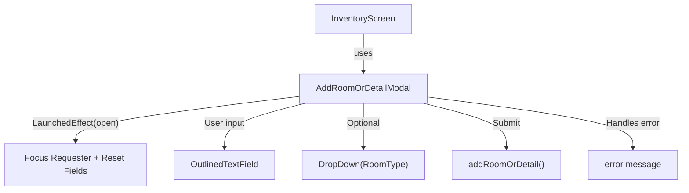
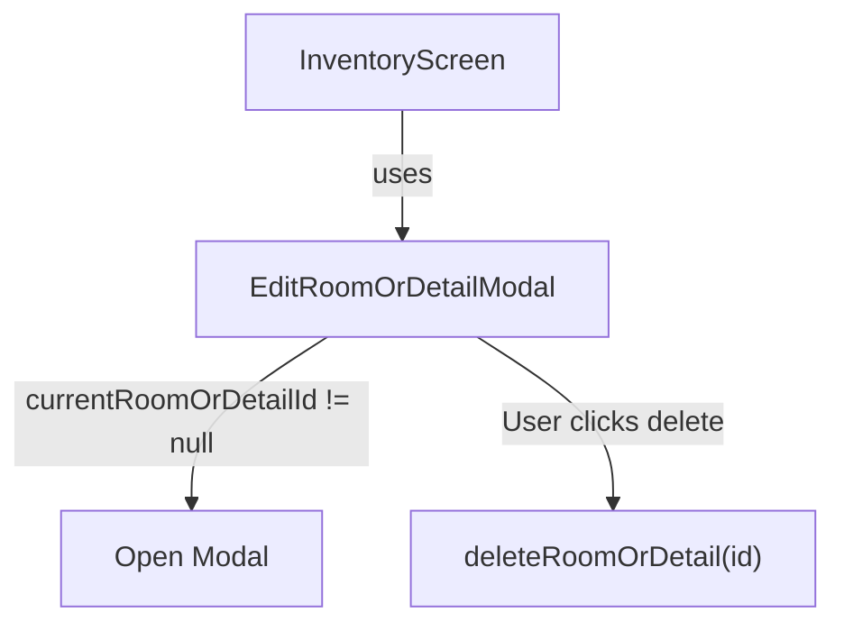
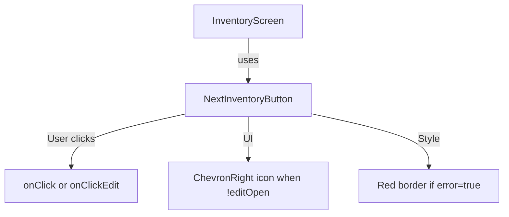

# Inventory Modals & Button

These components are used within the `InventoryScreen` to manage room/detail creation, deletion, and navigation between steps.

---

## AddRoomOrDetailModal

### UI Components

* **`BigModalLayout`**
  Modal container with fixed height (`0.3f`) and test tag `"addRoomOrDetailModal"`.

* **`OutlinedTextField` (Room/Detail Name)**
  Controlled input field with validation:

  * Error messages shown for:

    * `room_already_exists`
    * `detail_already_exists`
    * Other failure cases
  * Includes focus management (`FocusRequester`)
  * Test tag: `"roomNameTextField"`

* **`DropDown` (Optional Room Type)**
  Shown only when `addRoomType = true`.
  Dropdown for selecting a `RoomType` (e.g., `bedroom`, `kitchen`, `garage`, etc.)
  Test tag: `"dropDownRoomType"`

* **`Row` (Footer Buttons)**

  * **Cancel Button**: Closes modal
  * **Styled Submit Button**: Triggers `onSubmit` coroutine
    Test tags: `"addRoomModalCancel"`, `"addRoomModalConfirm"`

---

### Functionality

* **Create Room/Detail**
  On submit:

  * Clears error state
  * Calls `addRoomOrDetail(name, type?)`
  * Catches and stores errors

* **Focus Behavior**

  * On open: waits `500ms` then requests focus
  * On close: resets input and error state

---

### State Observed

* `roomName`: User input for name
* `roomType`: Selected room type
* `error`: Error string or `null`

---

### Data Flow

---

## EditRoomOrDetailModal

### UI Components

* **`BigModalLayout`**
  Modal layout with height `0.25f` and test tag `"editRoomOrDetailModal"`.

* **`StyledButton` (Delete)**

  * Calls `deleteRoomOrDetail(id)`
  * Closes modal before triggering deletion
  * Error styling enabled

---

### Functionality

* **Delete Room/Detail**

  * Only opens when `currentRoomOrDetailId != null`
  * Deletion is triggered on button click

---

### Data Flow

---

## NextInventoryButton

### UI Components

* **`Button`**
  Primary interactive button for continuing to the next inventory step.
  Dynamic behavior based on `editOpen`.

* **`Row` Layout**
  Left side: Optional icon and label
  Right side: `ChevronRight` icon if `editOpen = false`
  Includes spacing and alignment styling.

---

### Functionality

* **Click Behavior**

  * If `editOpen = true` → calls `onClickEdit`
  * Else → calls `onClick`

* **Visual Cues**

  * Border is red if `error = true`
  * Arrow icon only shown if `editOpen = false`

---

### Data Flow

