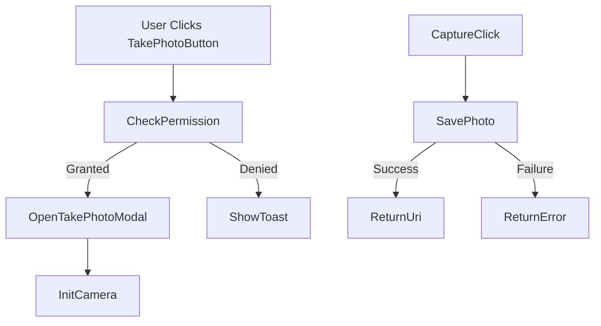

# TakePhotoButton & TakePhotoModal

---

## UI Components

### `TakePhotoButton`

* A composable button that triggers the device's camera.
* Handles camera permission requests.
* Opens a custom camera preview modal if permission is granted.

#### Behavior

* On click:

  * Checks for camera permission.
  * If granted: opens the `TakePhotoModal`.
  * If not: prompts user with permission request.
* If denied: shows a toast with error.
* If accepted: captures photo via modal and returns a `Uri`.

#### Parameters

* `onAfterImageModalIsShow`: Callback called after modal closes.
* `onImageCaptured(Uri)`: Returns the captured image's URI.
* `onError(ImageCaptureException)`: Triggered if the photo capture fails.

---

### `TakePhotoModal`

* Fullscreen bottom sheet modal using CameraX.
* Displays live camera preview and a circular capture button.

#### Behavior

* Initializes `PreviewView` with back camera.
* Configures and binds `Preview` and `ImageCapture` to lifecycle.
* On capture:

  * Saves photo to `Pictures` directory.
  * Calls `onImageCaptured(Uri)` or `onError(...)`.

#### Parameters

* `onImageCaptured(Uri)`: Called with the saved photo URI.
* `onError(ImageCaptureException)`: Triggered on failure.
* `onClose()`: Called to close the modal.
* `context`: Required to access camera and file storage.

---

## CameraX Integration

### `takePhoto(...)`

* Builds the file path using a timestamp format.
* Uses `ImageCapture.takePicture` to take a photo.
* On success: returns URI of saved image.
* On error: returns `ImageCaptureException`.

### `Context.getCameraProvider()`

* Suspended helper function to get `ProcessCameraProvider`.
* Ensures camera resources are obtained asynchronously.

---

## Permissions

* Uses `ActivityResultContracts.RequestPermission` to request `CAMERA` permission.
* Displays toast if user denies access.

---

## UI Elements

* **PreviewView**
  Displays live camera preview in `AndroidView`.

* **IconButton (Lens)**
  Circular white-stroked button to trigger the capture.

* **ModalBottomSheet**
  Used for camera UI — fullscreen modal containing the preview and capture button.

---

## Tags & Testing

* Modal has `testTag("addPropertyModal")` for UI tests.
* Camera interactions and permission logic can be unit/integration tested.

---

## Usage Flow

