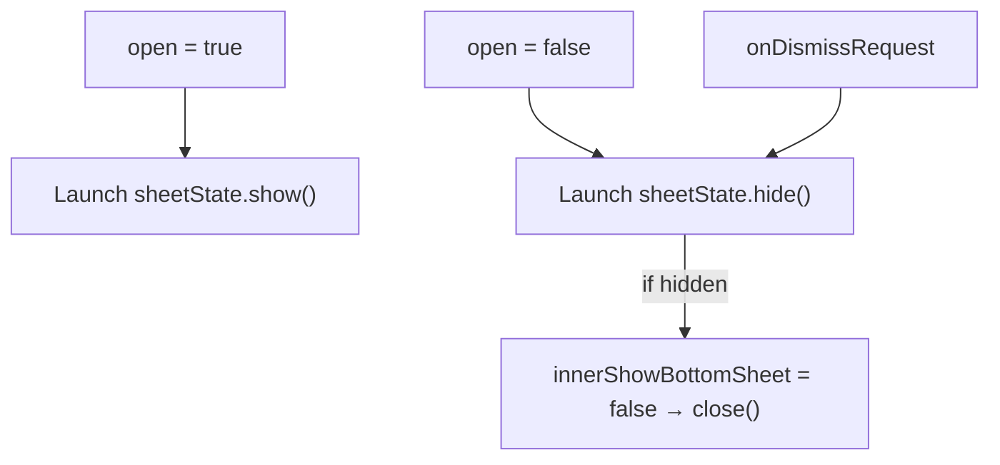

# BigModalLayout

---

## UI Layout

### `BigModalLayout`

* A customizable full-width `ModalBottomSheet` used for large modal dialogs.
* Supports dynamic height as a percentage of screen height.
* Allows external open/close control via `open` and `close` parameters.
* Wraps content in a padded `Column` with configurable background color.
* Uses `Material3` theming and `testTag` for UI testing.

---

## Parameters

* `height: Float`
  Modal height as a **fraction** of screen height (e.g., `0.8f` for 80%).

* `open: Boolean`
  Boolean flag that controls the visibility of the modal.
  When `true`, modal appears; when `false`, it closes.

* `close: () -> Unit`
  Callback invoked when the modal is dismissed either by user or programmatically.

* `testTag: String = "bigModalLayout"`
  Tag for UI testing; defaults to `"bigModalLayout"`.

* `backgroundColor: Color = MaterialTheme.colorScheme.surface`
  Optional background color of the modal. Defaults to themed surface color.

* `content: @Composable () -> Unit`
  The content displayed inside the modal sheet.

---

## Behavior

* Uses `rememberModalBottomSheetState()` with `skipPartiallyExpanded = true` to always expand fully.

* Calculates modal height from screen height using `LocalConfiguration`.

* Modal visibility is driven by the `open` flag:

  * On `open = true`: sets internal state and shows the modal.
  * On `open = false`: hides the modal and triggers the `close()` callback.

* Modal closes when:

  * User swipes down.
  * Parent composable sets `open = false`.
  * `onDismissRequest` is triggered.

---

## Styling

* **Sheet**:

  * `fillMaxWidth()`
  * `heightIn(modalHeight)`
  * `containerColor` = `backgroundColor`
  * `testTag` = provided `testTag` value

* **Content Column**:

  * `fillMaxWidth()`
  * `padding`: 8dp bottom, 0dp top, 8dp sides
  * `background`: `backgroundColor`

---

## State

* `innerShowBottomSheet: Boolean`
  Internal flag to ensure the sheet is only rendered when `true`.

* `sheetState`
  Controls the state of the modal (shown/hidden).

---

## Usage Flow

---

## Notes

* Suitable for use cases like forms, inputs, or modals needing large vertical space.
* The modal height can dynamically adapt based on device size.
* Can be reused for different modal screens by passing different content.
