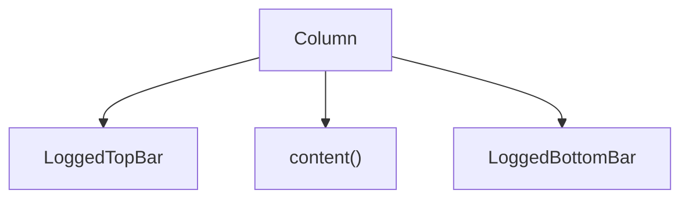

# DashBoardLayout

---

## UI Layout

### `DashBoardLayout`

* High-level screen layout scaffold for authenticated sections of the app.
* Combines:

  * A **top bar** (`LoggedTopBar`)
  * A **bottom navigation bar** (`LoggedBottomBar`)
  * A **central content area** passed as a composable.

---

## Parameters

* `navController: NavController`
  Navigation controller used by top and bottom bars for navigation or logout.

* `testTag: String`
  Identifier for testing the outer layout wrapper using Compose UI test tools.

* `content: @Composable () -> Unit`
  The dynamic screen content rendered between the top and bottom bars.

---

## Structure

---

## Layout Behavior

* Wraps all content in a top-level `Column` with the provided `testTag`.
* `LoggedTopBar` is placed at the top of the screen.
* The dynamic `content` is rendered inside a nested `Column` with:

  * `Modifier.weight(1f)` — takes up all available vertical space.
  * `padding(2.dp)`
  * `testTag("dashboardLayout")` — for UI testing of central content.
* `LoggedBottomBar` is always anchored at the bottom.

---

## Notes

* Provides consistent navigation and branding layout for pages shown to logged-in users.
* Can be reused for any screen where both top/bottom bars should be visible.
* The center content is scrollable or static based on the composable passed in `content()`.
