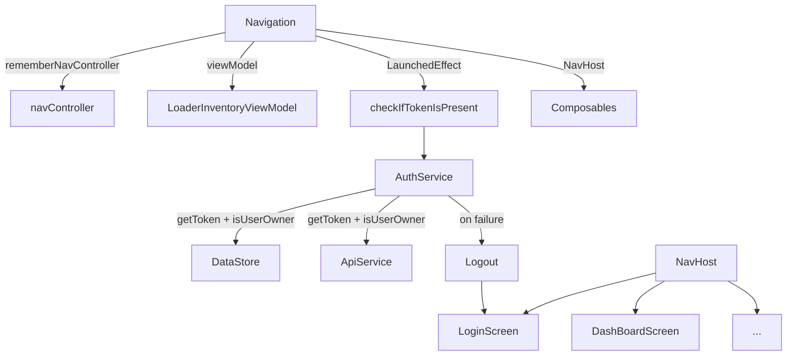

# Navigation

## Overview

`Navigation()` is the root Composable responsible for setting up **screen routing** using Jetpack Compose Navigation.  
It determines which screen to display based on the current route and enforces **authentication checks** at app launch.

---

## Navigation Graph

### `NavHost`

Defines the app's navigation structure, with:

* **`startDestination`**: `"dashboard"`
* **Routes**:
  * `"login"` → [`LoginScreen`](../pages/login.md)
  * `"dashboard"` → [`DashBoardScreen`](../pages/dashboard.md)
  * `"register"` → [`RegisterScreen`](../pages/register.md)
  * `"profile"` → [`ProfileScreen`](../pages/profile.md)
  * `"messages"` → [`Messages`](../pages/messages.md)
  * `"realProperty"` → [`RealPropertyScreen`](../pages/realProperty/index.md)
  * `"inventory/{propertyId}/{leaseId}"` → [`InventoryScreen`](../pages/inventory/index.md) with dynamic arguments

---

## Composable Setup

```kotlin
@Composable
fun Navigation()
```

* Initializes `NavController` via `rememberNavController()`.
* Retrieves global dependencies:

  * `apiService` from `LocalApiService`
  * `isOwner` from `LocalIsOwner`
  * `LoaderInventoryViewModel` scoped to navigation lifecycle

---

## Initial Authentication Check

### `LaunchedEffect(Unit)`

Triggers once on composition to:

```kotlin
checkIfTokenIsPresent(navController, apiService, isOwner)
```

---

## Token Verification Logic

### `checkIfTokenIsPresent(...)`

* Instantiates `AuthService` with `DataStore` and `ApiService`
* If the current route is `"dashboard"`:

  1. Tries to retrieve a valid token via `authServ.getToken()`
  2. Checks if user is owner: `authServ.isUserOwner()`
  3. On failure, calls `authServ.onLogout(navController)` to redirect to login

> ✅ Ensures secure app startup
> ✅ Automatically logs out if token is invalid

---

## Dynamic Route Handling

```kotlin
composable("inventory/{propertyId}/{leaseId}") { navBackStackEntry -> ... }
```

* Extracts `propertyId` and `leaseId` from the route.
* Passes them to `InventoryScreen` with the shared `LoaderInventoryViewModel`.

---

## Data Flow



---

## Global Dependencies

* `LocalApiService` → For all API calls within screens
* `LocalIsOwner` → Used to enable/disable features like property editing

