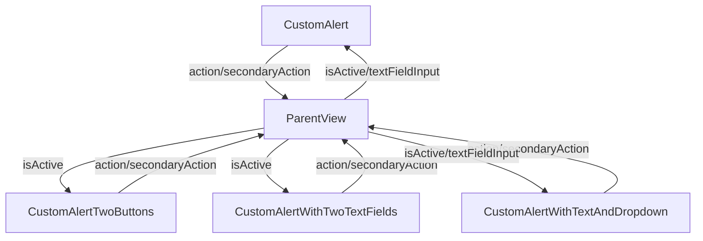

# Custom Alert Views

## Overview

The `CustomAlert`, `CustomAlertTwoButtons`, `CustomAlertWithTwoTextFields`, and `CustomAlertWithTextAndDropdown` are SwiftUI views in the Immotep app designed to display customizable alert dialogs. These views provide various input options (text fields, dropdowns) and buttons for user interaction, with support for keyboard handling, animations, and localization.

---

## UI Components

### Shared Components
* `ZStack`: Layers a semi-transparent background and the alert content.
* `Color(.black).opacity(0.5)`: Darkens the background and allows dismissal on tap.
* `VStack`: Organizes the alert content (title, message, inputs, buttons).
* `Text`: Displays the title and message with localized text.
* `Button`: Primary and optional secondary buttons for actions (e.g., "Validate", "Cancel").
* `RoundedRectangle`: Used for button backgrounds and text field borders.
* Animations: Spring animation for opening and ease-in-out for closing and keyboard adjustments.

### Specific Components
* **CustomAlert**:
  * `TextField`: Single text input field.
* **CustomAlertTwoButtons**:
  * No input fields, only title, message, and buttons.
* **CustomAlertWithTwoTextFields**:
  * Two `TextField`s: One for a string (e.g., name) and one for a number (e.g., quantity, restricted to digits).
* **CustomAlertWithTextAndDropdown**:
  * `TextField`: For entering a room name.
  * `Picker`: Menu-style picker for selecting a room type (e.g., "bedroom", "kitchen").

---

## Functionality

* **Purpose**: Provide reusable alert dialogs for various user interactions (e.g., adding rooms, deleting items, confirming actions).
* **Common Features**:
  * Display a title and message (localized).
  * Support a primary action button and an optional secondary button (e.g., "Cancel").
  * Animated appearance/disappearance with a sliding effect (`offset`).
  * Keyboard handling: Adjusts position based on keyboard height using `keyboardPublisher`.
  * Dismissal: Closes on button press or background tap, with a safeguard (`isClosing`) to prevent multiple dismissals.
* **Specific Features**:
  * **CustomAlert**:
    * Single text input bound to `textFieldInput`.
    * Used for simple text-based inputs.
  * **CustomAlertTwoButtons**:
    * No input fields, used for confirmation dialogs (e.g., delete confirmation).
  * **CustomAlertWithTwoTextFields**:
    * Two inputs: a string (`textFieldInputString`) and a numeric field (`textFieldInputInt`, restricted to digits).
    * Action returns a string and an integer (e.g., name and quantity).
    * Primary button disabled if either field is empty.
  * **CustomAlertWithTextAndDropdown**:
    * Text input for room name (`textFieldInput`) and a `Picker` for room type (`selectedRoomType`).
    * Room types defined in `roomTypeMapping` (e.g., "dressing", "kitchen") with localized display names.
    * Action returns the room name and selected type.
    * Primary button disabled if the text field is empty.

---

## Data Flow

---

## Navigation

* No direct navigation; these are modal views presented by parent views (e.g., `InventoryRoomView`, `InventoryStuffView`).
* Dismissed by:
  * Tapping the background.
  * Pressing the primary or secondary button, which triggers `close()`.

---

## Helper Functions and Features

* **close()**:
  * Animates the alert out (slides down with `offset = 1000`).
  * Sets `isActive` to false after a delay to complete the animation.
  * Uses `isClosing` to prevent multiple dismissals.
* **keyboardPublisher**:
  * Uses Combine to listen for `UIResponder.keyboardWillShowNotification` and `keyboardWillHideNotification`.
  * Adjusts `keyboardHeight` to shift the alert above the keyboard.
* **Localization**:
  * All text (title, message, button labels, placeholders) is localized using `.localized()`.
* **Accessibility**:
  * Accessibility identifiers are not explicitly defined in these views but are set in parent views (e.g., `AddRoomAlert`, `AddStuffAlert`).

---

## Notes

* All alerts share a consistent design with a semi-transparent background, rounded corners, and a shadow effect.
* The `CustomAlertWithTextAndDropdown` includes a predefined list of room types, ensuring consistency with API values.
* The `CustomAlertWithTwoTextFields` enforces numeric input for the quantity field using `onChange` filtering.
* The views use `Color("textColor")`, `Color("basicWhiteBlack")`, and `Color("LightBlue")` for theme consistency.
* The `ignoresSafeArea()` ensures the alert covers the entire screen, including safe areas.
