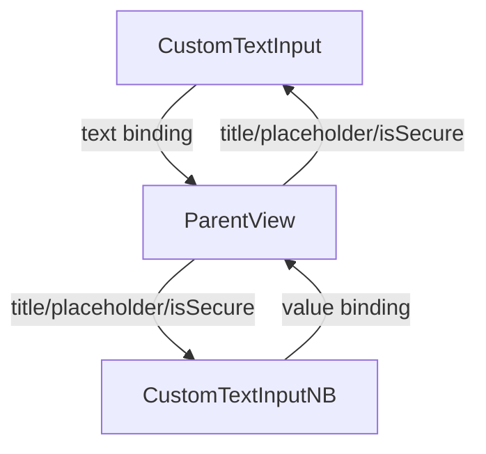

# Custom Text Input Views

## Overview

The `CustomTextInput` and `CustomTextInputNB` are SwiftUI views in the Immotep app designed to provide reusable text input fields with customizable properties. `CustomTextInput` handles string input, while `CustomTextInputNB` handles numeric input (stored as `NSNumber`). Both support secure text entry, localization, and accessibility.

---

## UI Components

### Shared Components
* `VStack`: Organizes the layout with a title and input field.
* `Text`: Displays the localized title.
* `RoundedRectangle`: Background for the input field with `Color("textfieldBackground")`.
* `TextField` or `SecureField`: For text or secure input, respectively.
* Accessibility: Each input field has an accessibility identifier based on the title.

### Specific Components
* **CustomTextInput**:
  * `Button`: Toggles visibility for secure fields (shows/hides password with "eye" or "eye.slash" icon).
  * `SecureField` or `TextField`: Based on `isSecure` and `isSecured` state.
* **CustomTextInputNB**:
  * `SecureField` or `TextField`: For numeric input, with formatting for integer or decimal display.
  * No visibility toggle (numeric fields typically don’t require it).

---

## Functionality

* **Purpose**:
  * `CustomTextInput`: Handles string input, with optional secure entry (e.g., for passwords).
  * `CustomTextInputNB`: Handles numeric input (stored as `NSNumber`), supporting integers or decimals (e.g., for quantities or prices).
* **Features**:
  * **Localization**: Titles and placeholders are localized using `.localized()`.
  * **Secure Input**:
    * `CustomTextInput`: Toggles between `SecureField` and `TextField` with an eye icon for password visibility.
    * `CustomTextInputNB`: Supports secure numeric input but lacks a visibility toggle.
  * **Numeric Formatting** (`CustomTextInputNB`):
    * Displays integers without decimals (e.g., "5") and decimals with two places (e.g., "5.00").
    * Converts input to `NSNumber` (integer or double) or sets to `nil` if invalid.
  * **Styling**:
    * Consistent font size (14) and background color (`textfieldBackground`).
    * Foreground color (`placeholderColor`) for placeholders.
    * Disables autocapitalization for consistent input.
  * **Accessibility**:
    * Accessibility identifiers (e.g., `"\(title)_textfield"`) for testing and accessibility support.

---

## Data Flow

---

## Navigation

* No direct navigation; these are reusable components embedded in parent views (e.g., `RegisterView`, `LoginView`, `SettingsView`).

---

## Helper Features

* **CustomTextInput**:
  * `isSecured`: State variable to toggle between secure and visible text for password fields.
  * Button with `eye`/`eye.slash` icon for toggling visibility.
* **CustomTextInputNB**:
  * Custom binding to convert text input to `NSNumber`:
    * Attempts to parse input as an integer or double.
    * Formats output as an integer if whole, or with two decimal places if fractional.
    * Sets `value` to `nil` for invalid input.
  * Uses `.numberPad` keyboard type implicitly (though not explicitly set in code).

---

## Notes

* Both views use consistent theming with `Color("textfieldBackground")` and `Color("placeholderColor")`.
* `CustomTextInputNB` is designed for numeric input but does not enforce `.numberPad` keyboard type explicitly, relying on parent views to set it if needed.
* Localization ensures multilingual support for titles and placeholders.
* Accessibility identifiers enhance testability and accessibility.
* `CustomTextInput` is used in views like `RegisterView`, `LoginView`, and `SettingsView`, while `CustomTextInputNB` is likely used for numeric fields (e.g., quantities or prices, though not explicitly shown in provided views).
