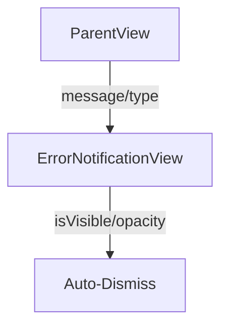

# Notification View

## Overview

The `ErrorNotificationView` is a SwiftUI view in the Keyz app designed to display temporary notifications for errors or success messages. It supports two types of notifications (error and success) with distinct visual styles and durations, using animations for smooth appearance and dismissal.

---

## UI Components

* `ZStack`: Layers the notification content over the parent view.
* `VStack`: Positions the notification at the bottom of the screen.
* `HStack`: Organizes the icon and message horizontally.
* `Image`: Displays an icon (`checkmark.circle.fill` for success, `exclamationmark.triangle.fill` for error).
* `Text`: Displays the localized message.
* `RoundedRectangle`: Background with `Color("GreenAlert")` for success or `Color("RedAlert")` for error.
* Modifiers:
  * `cornerRadius(8)`: Rounds the corners of the notification.
  * `shadow`: Adds a subtle shadow for depth.
  * `padding`: Ensures spacing around the notification.
  * `transition(.opacity)` and `animation(.easeInOut)`: Smoothly fades the notification in and out.

---

## Functionality

* **Purpose**: Displays temporary notifications for user feedback (e.g., errors during API calls or successful actions).
* **Features**:
  * **Notification Types**:
    * `error`: Red background (`Color("RedAlert")`), shown for 5 seconds.
    * `success`: Green background (`Color("GreenAlert")`), shown for 2 seconds.
  * **Animation**:
    * Fades in on appear (`opacity` from 0.0 to 1.0).
    * Fades out after the specified duration (`duration`).
  * **Auto-Dismissal**:
    * Uses `DispatchQueue.main.asyncAfter` to fade out and hide the view after the duration.
    * Success notifications disappear faster (2 seconds) than error notifications (5 seconds).
  * **Localization**: The message is localized (assumed to be passed as a localized string from the parent view).
* **State**:
  * `isVisible`: Controls whether the notification is shown.
  * `opacity`: Manages the fade-in/fade-out animation.

---

## Data Flow

---

## Navigation

* No direct navigation; this is a transient view embedded in parent views (e.g., `RegisterView`, `LoginView`, `InventoryRoomView`).
* Automatically dismisses after the specified duration without user interaction.

---

## Helper Features

* **NotificationType Enum**:
  * Defines `error` and `success` cases to determine styling and duration.
* **Duration**:
  * Computed property returns 2.0 seconds for success and 5.0 seconds for error.
* **Animation**:
  * Uses `.easeInOut(duration: 0.3)` for smooth opacity transitions.
  * Triggers `isVisible = false` after the fade-out animation completes.
* **Theming**:
  * Uses `Color("GreenAlert")` and `Color("RedAlert")` for consistent styling.
  * Applies a shadow for visual depth.

---

## Notes

* The view is reusable across the app for both error and success feedback.
* Localization is assumed to be handled by parent views passing localized strings.
* No accessibility identifiers are explicitly defined, which could be added for testing.
* The view is non-interactive, relying on auto-dismissal for user experience.
