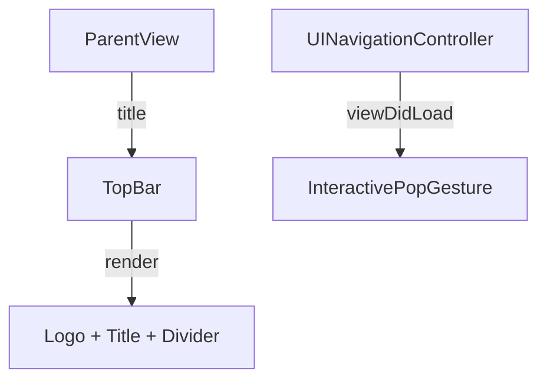

# Top Bar View

## Overview

The `TopBar` is a SwiftUI view in the Immotep app used as a consistent header across multiple screens (e.g., `LoginView`, `SettingsView`, `InventoryRoomView`). It displays the app logo and a title, with a divider for visual separation. Additionally, an extension to `UINavigationController` is included to enable the interactive pop gesture.

---

## UI Components

* **TopBar**:
  * `VStack`: Organizes the logo, title, and divider vertically with no spacing.
  * `HStack`: Aligns the logo and title horizontally.
  * `Image`: Displays the "KeyzLogo" with a fixed size (50x50).
  * `Text`: Displays the localized title (passed as a parameter) with a bold `title2` font and single-line limit.
  * `Divider`: Adds a horizontal line below the header, styled with `Color("textColor")`.
  * Modifiers:
    * `.padding(.leading, 20)`: Aligns content with left padding.
    * `.padding(.top, 15)`: Adds spacing above the divider.

* **UINavigationController Extension**:
  * Overrides `viewDidLoad()` to set `interactivePopGestureRecognizer?.delegate = nil`, enabling the default swipe-to-go-back gesture.

---

## Functionality

* **Purpose**: Provides a consistent header for navigation screens, displaying the app logo and a screen-specific title.
* **Features**:
  * Displays the "KeyzLogo" and a localized title.
  * Uses a divider to separate the header from the content below.
  * Supports theme consistency with `Color("textColor")` for the divider.
  * The `UINavigationController` extension ensures the interactive pop gesture (swipe to go back) is enabled across the app.

---

## Data Flow

---

## Navigation

* **TopBar**: No direct navigation; it’s a static header component embedded in parent views (e.g., `LoginView`, `SettingsView`, `InventoryRoomView`).
* **UINavigationController Extension**:
  * Enables the interactive pop gesture for navigation controllers, allowing users to swipe left-to-right to navigate back in the navigation stack.

---

## Helper Features

* **Localization**: The title is localized (assumed to be passed as a localized string from the parent view).
* **Theming**: Uses `Color("textColor")` for the divider to align with the app’s theme.
* **Accessibility**: No explicit accessibility identifiers are defined in the provided code, but could be added for testing or accessibility support.

---

## Notes

* The `TopBar` is reused across multiple views for consistent branding and navigation.
* The title is limited to one line (`lineLimit(1)`) to prevent overflow.
* The `UINavigationController` extension is a global configuration, ensuring swipe-back functionality is consistently enabled.
