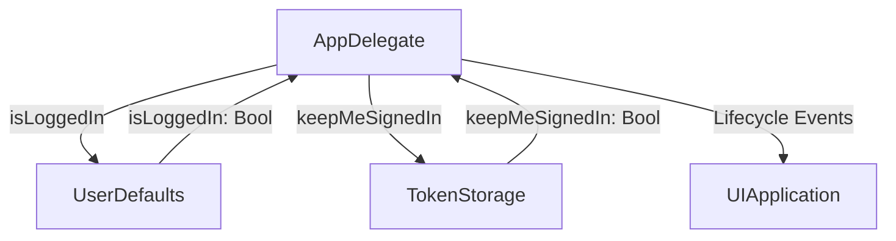

# AppDelegate Documentation

## Overview

The `AppDelegate.swift` file in the Keyz app manages the application lifecycle events and integrates with authentication state handling. It uses `UserDefaults` and `TokenStorage` to manage the `isLoggedIn` state, ensuring proper session handling when the app becomes active or terminates.

---

## Functionality

### `application(_:didFinishLaunchingWithOptions:)`
* **Purpose**: Initializes the app when it launches.
* **Parameters**:
  * `application: UIApplication`: The application instance.
  * `launchOptions: [UIApplication.LaunchOptionsKey: Any]?`: Launch options dictionary.
* **Features**:
  * Called when the app finishes launching.
  * Returns `true` to indicate successful initialization.
* **Usage Example**:
  ```swift
  func application(_ application: UIApplication, didFinishLaunchingWithOptions launchOptions: [UIApplication.LaunchOptionsKey: Any]?) -> Bool {
      return true
  }
  ```

### `applicationWillResignActive(_:)`
* **Purpose**: Handles the app transitioning to an inactive state.
* **Parameters**:
  * `application: UIApplication`: The application instance.
* **Features**:
  * Currently empty, available for handling tasks when the app loses focus (e.g., pausing ongoing tasks).
* **Usage Example**:
  ```swift
  func applicationWillResignActive(_ application: UIApplication) {
      // Add code to pause tasks or save state
  }
  ```

### `applicationDidEnterBackground(_:)`
* **Purpose**: Handles the app entering the background state.
* **Parameters**:
  * `application: UIApplication`: The application instance.
* **Features**:
  * Currently empty, available for saving state or cleaning up resources when the app is no longer visible.
* **Usage Example**:
  ```swift
  func applicationDidEnterBackground(_ application: UIApplication) {
      // Add code to save data or release resources
  }
  ```

### `applicationWillEnterForeground(_:)`
* **Purpose**: Handles the app returning to the foreground.
* **Parameters**:
  * `application: UIApplication`: The application instance.
* **Features**:
  * Currently empty, available for resuming tasks or refreshing UI when the app becomes visible.
* **Usage Example**:
  ```swift
  func applicationWillEnterForeground(_ application: UIApplication) {
      // Add code to resume tasks or refresh UI
  }
  ```

### `applicationDidBecomeActive(_:)`
* **Purpose**: Handles the app becoming active.
* **Parameters**:
  * `application: UIApplication`: The application instance.
* **Features**:
  * Checks `TokenStorage.keepMeSignedIn()` to determine if the user should remain logged in.
  * If `keepMeSignedIn` is `false`, sets `isLoggedIn` to `false` in `UserDefaults`.
* **Usage Example**:
  ```swift
  func applicationDidBecomeActive(_ application: UIApplication) {
      if !TokenStorage.keepMeSignedIn() {
          UserDefaults.standard.set(false, forKey: "isLoggedIn")
      }
  }
  ```

### `applicationWillTerminate(_:)`
* **Purpose**: Handles the app termination.
* **Parameters**:
  * `application: UIApplication`: The application instance.
* **Features**:
  * Checks `TokenStorage.keepMeSignedIn()` to determine if the user should remain logged in.
  * If `keepMeSignedIn` is `false`, sets `isLoggedIn` to `false` in `UserDefaults` to log out the user.
* **Usage Example**:
  ```swift
  func applicationWillTerminate(_ application: UIApplication) {
      if !TokenStorage.keepMeSignedIn() {
          UserDefaults.standard.set(false, forKey: "isLoggedIn")
      }
  }
  ```

---

## Data Flow



---

## Integration

* **Usage**: The `AppDelegate` manages app lifecycle events and integrates with `UserDefaults` and `TokenStorage` to handle authentication state (`isLoggedIn`).
* **Context**:
  * `isLoggedIn` is stored in `UserDefaults` using `@AppStorage` for SwiftUI integration, likely controlling the app’s navigation (e.g., showing login screen when `false`).
  * `TokenStorage.keepMeSignedIn()` determines whether to persist the login state during app active or termination events.
* **Assumptions**:
  * `TokenStorage` is a custom class managing authentication tokens and user preferences for persistent login.
  * The `isLoggedIn` state is used across the app (e.g., in views like `LoginView` or `PropertyViewModel`) to determine UI flow.
  * Lifecycle methods like `applicationWillResignActive`, `applicationDidEnterBackground`, and `applicationWillEnterForeground` are placeholders for future functionality.

---

## Helper Features

* **Authentication Handling**:
  * The `isLoggedIn` state is updated in `applicationDidBecomeActive` and `applicationWillTerminate` based on `TokenStorage.keepMeSignedIn()`.
  * Ensures the app logs out users who haven’t enabled persistent login when the app becomes active or terminates.
* **Error Handling**:
  * No explicit error handling for `UserDefaults` or `TokenStorage` operations, assuming they are reliable.
* **Flexibility**:
  * Lifecycle methods are extensible for adding custom behavior (e.g., saving state, refreshing data, or handling notifications).
* **SwiftUI Integration**:
  * Uses `@AppStorage` for seamless integration with SwiftUI’s state management, allowing views to react to `isLoggedIn` changes.

---

## Notes

* The `AppDelegate` is minimal, focusing on authentication state management during specific lifecycle events.
* Empty lifecycle methods (`applicationWillResignActive`, `applicationDidEnterBackground`, `applicationWillEnterForeground`) suggest potential for future enhancements (e.g., state preservation or notifications).
* Relies on `TokenStorage`, which is not defined in the provided code, assuming it handles token persistence logic.
* Consider adding error handling for `TokenStorage` or `UserDefaults` failures to improve robustness.
* Localization is not relevant here, as no user-facing strings are used.
