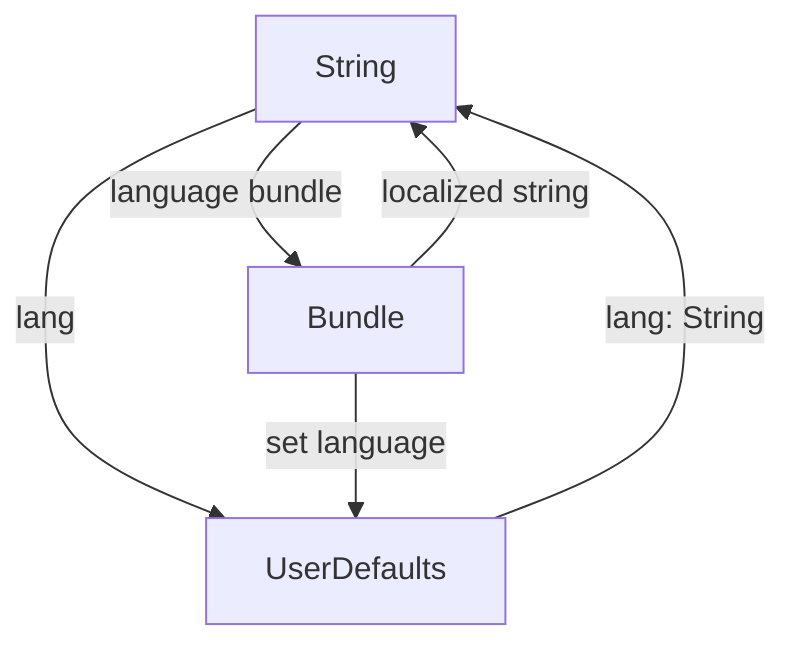

# Bundle Extensions Documentation

## Overview

The `Bundle.swift` file in the Keyz app extends the `String` and `Bundle` classes to support localization by managing language settings and retrieving localized strings based on the user's selected language.

---

## Functionality

### `String.localized() -> String`
* **Purpose**: Returns the localized version of a string based on the user's selected language.
* **Parameters**: None (operates on the receiver `String`).
* **Features**:
  * Retrieves the current language from `UserDefaults` using the key `"lang"`, defaulting to `"en"` if not set.
  * Loads the corresponding `.lproj` bundle for the language (e.g., `en.lproj`).
  * Uses `NSLocalizedString` to fetch the localized string from the bundle.
  * Falls back to the original string if the bundle or localization fails.
* **Usage Example**:
  ```swift
  let greeting = "hello".localized() // Returns localized string for "hello" (e.g., "bonjour" for French)
  ```

### `Bundle.setLanguage(_:)`
* **Purpose**: Sets the app's language and persists it in `UserDefaults`.
* **Parameters**:
  * `language: String`: The language code to set (e.g., `"en"`, `"fr"`).
* **Features**:
  * Marked with `@MainActor` to ensure UI thread safety.
  * Stores the language code in `UserDefaults` under the key `"lang"`.
  * Calls `UserDefaults.standard.synchronize()` to ensure immediate persistence.
* **Usage Example**:
  ```swift
  await Bundle.setLanguage("fr") // Sets app language to French
  ```

---

## Data Flow



---

## Integration

* **Usage**: The `String.localized()` extension is used throughout the app’s UI to display localized text (e.g., in views like `PropertyDetailView` or labels in forms). The `Bundle.setLanguage(_:)` function is called when the user changes the language setting (e.g., in a settings view).
* **Context**:
  * `String.localized()` relies on `.lproj` files in the app bundle (e.g., `en.lproj`, `fr.lproj`) containing localized strings.
  * `Bundle.setLanguage(_:)` updates the app’s language, affecting all subsequent `localized()` calls.
* **Assumptions**:
  * The app includes `.lproj` resource files for supported languages.
  * The `"lang"` key in `UserDefaults` is set by a settings view or initial app configuration.
  * No automatic UI refresh is implemented after `setLanguage(_:)`, assuming views are redrawn manually or via state changes.

---

## Helper Features

* **Localization**:
  * Supports dynamic language switching by loading the appropriate `.lproj` bundle.
  * Falls back to the original string if localization fails, ensuring graceful degradation.
* **Error Handling**:
  * Handles missing language bundles by returning the original string.
  * No explicit error logging or user feedback for missing `.lproj` files.
* **Thread Safety**:
  * `setLanguage(_:)` is `@MainActor`-annotated to ensure safe updates to `UserDefaults` on the main thread.

