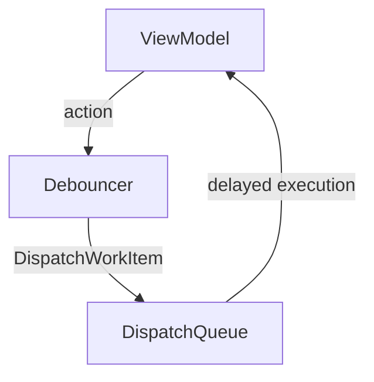

# Debouncer Documentation

## Overview

The `Debouncer.swift` file in the Keyz app provides a utility class for debouncing actions, delaying execution to prevent rapid successive calls, useful for handling user input or API requests.

---

## Functionality

### `init(delay:)`
* **Purpose**: Initializes a `Debouncer` with a specified delay.
* **Parameters**:
  * `delay: TimeInterval`: The delay (in seconds) before executing the debounced action.
* **Features**:
  * Stores the delay for use in the `debounce` method.
* **Usage Example**:
  ```swift
  let debouncer = Debouncer(delay: 0.5) // Creates debouncer with 0.5-second delay
  ```

### `debounce(_:)`
* **Purpose**: Schedules a block of code to execute after the specified delay, canceling any previous pending execution.
* **Parameters**:
  * `block: @escaping () -> Void`: The closure to execute after the delay.
* **Features**:
  * Cancels any existing `DispatchWorkItem` to prevent duplicate executions.
  * Schedules the new block on the main queue using `DispatchQueue.main.asyncAfter`.
* **Usage Example**:
  ```swift
  debouncer.debounce {
      print("Action executed after delay")
  }
  ```

---

## Data Flow



---

## Integration

* **Usage**: `Debouncer` is used to throttle rapid user inputs (e.g., search queries or button taps) or API calls, likely in view models like `PropertyViewModel` or UI components like search bars.
* **Context**:
  * Prevents excessive API calls or UI updates by ensuring only the last action in a rapid sequence is executed.
  * Likely used in contexts like real-time search or form submissions.
* **Assumptions**:
  * The delay is chosen based on the specific use case (e.g., 0.3–1.0 seconds for user input).
  * Executes on the main queue, assuming the debounced action updates the UI or triggers view model changes.

---

## Helper Features

* **Performance**:
  * Reduces redundant executions, improving app responsiveness and reducing server load.
* **Thread Safety**:
  * Executes on the main queue, ensuring UI updates are thread-safe.
* **Error Handling**:
  * No explicit error handling; assumes the provided block is valid.

