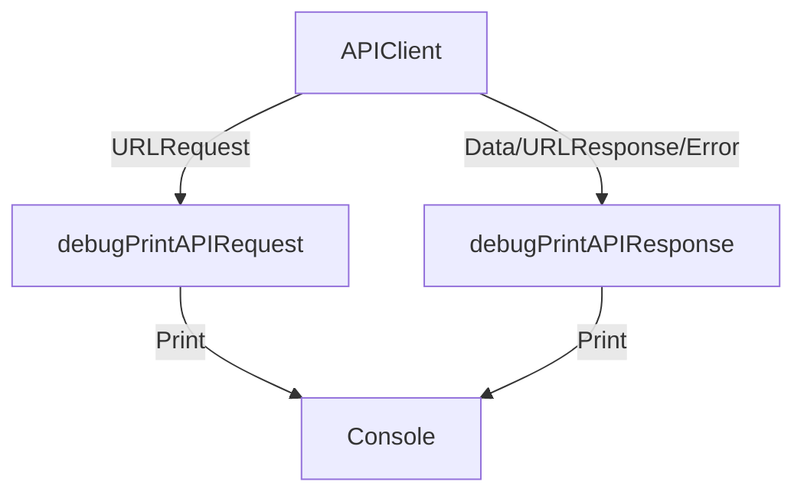

# Debug API Request and Response Functions

## Overview

The `debugPrintAPIRequest` and `debugPrintAPIResponse` are utility functions in the Keyz app designed for debugging HTTP requests and responses. They print detailed information about API requests and their corresponding responses to the console, aiding developers in diagnosing network-related issues.

---

## Functionality

### `debugPrintAPIRequest(_:)`
* **Purpose**: Logs detailed information about an outgoing `URLRequest`.
* **Parameters**:
  * `request: URLRequest`: The HTTP request to debug.
* **Features**:
  * Prints the request's URL, HTTP method, headers, and body.
  * For the body:
    * Attempts to parse the body as JSON and pretty-print it if valid.
    * Falls back to raw string representation if JSON parsing fails or if the body is not JSON.
  * Handles cases where the URL, headers, or body are absent, printing appropriate placeholders (e.g., "No URL", "No headers", "No body").
* **Output Format**:
  ```
  ===== Debug API Request =====
  URL: <request URL>
  HTTP Method: <method>
  Headers:
    <key>: <value>
    ...
  Body:
    <pretty-printed JSON or raw string>
  ============================
  ```

### `debugPrintAPIResponse(_:response:error:)`
* **Purpose**: Logs detailed information about an API response.
* **Parameters**:
  * `data: Data?`: The response data (optional).
  * `response: URLResponse?`: The response metadata (optional).
  * `error: Error?`: Any error that occurred (optional).
* **Features**:
  * Prints the HTTP status code if the response is an `HTTPURLResponse`.
  * Prints the response body as a string (if available).
  * Prints any error's localized description (if present).
  * Handles cases where data or response is absent, printing "No response body" as needed.
* **Output Format**:
  ```
  ===== Debug API Response =====
  Status Code: <code>
  Response Body: <string>
  Error: <error description>
  ============================
  ```

---

## Data Flow



---

## Integration

* **Usage**: These functions are likely called within API client code (e.g., `UserService`, `InventoryViewModel`) before sending requests and after receiving responses.
* **Context**: Used in development to debug API interactions, typically in conjunction with `URLSession` or similar networking code.
* **Assumptions**:
  * The app uses `URLSession` for HTTP requests (based on `URLRequest` and `URLResponse`).
  * The functions are called explicitly in debug builds or during development.

---

## Helper Features

* **JSON Pretty Printing** (`debugPrintAPIRequest`):
  * Uses `JSONSerialization` to parse and reformat JSON data for readability.
  * Falls back to raw string output if JSON parsing fails.
* **Error Handling**:
  * Safely handles optional parameters (`url`, `httpBody`, `data`, `response`, `error`).
  * Provides meaningful defaults for missing data.
* **Console Output**: Structured and formatted for easy reading, with clear section separators.

---

## Notes

* These functions are intended for debugging and should be disabled or removed in production builds to avoid logging sensitive data (e.g., tokens in headers or body).
* No localization is applied, as the output is for developer use only.
* No accessibility considerations, as the output is console-based.
* The functions assume UTF-8 encoding for string conversion, which is standard for most APIs but may need adjustment for non-UTF-8 responses.
