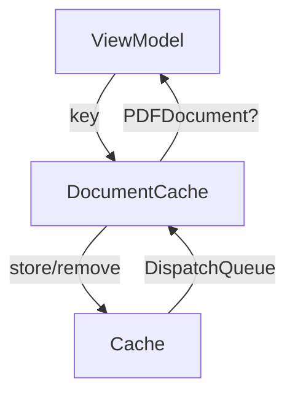

# DocumentCache Documentation

## Overview

The `DocumentCache.swift` file in the Keyz app provides a thread-safe singleton cache for storing and managing `PDFDocument` objects, optimizing performance by reducing redundant loading of PDF documents.

---

## Functionality

### `getDocument(forKey:) -> PDFDocument?`
* **Purpose**: Retrieves a cached `PDFDocument` for a given key.
* **Parameters**:
  * `key: String`: The unique identifier for the document.
* **Features**:
  * Uses a concurrent `DispatchQueue` for thread-safe reads.
  * Returns the cached `PDFDocument` or `nil` if not found.
* **Usage Example**:
  ```swift
  let pdf = DocumentCache.shared.getDocument(forKey: "doc123") // Returns cached PDFDocument or nil
  ```

### `setDocument(_:forKey:)`
* **Purpose**: Stores a `PDFDocument` in the cache for a given key.
* **Parameters**:
  * `document: PDFDocument?`: The PDF document to cache (nullable).
  * `key: String`: The unique identifier for the document.
* **Features**:
  * Uses a concurrent `DispatchQueue` with `.barrier` flag for thread-safe writes.
* **Usage Example**:
  ```swift
  DocumentCache.shared.setDocument(pdfDocument, forKey: "doc123") // Caches the PDFDocument
  ```

### `clearCache()`
* **Purpose**: Clears all cached `PDFDocument` objects.
* **Features**:
  * Uses a concurrent `DispatchQueue` with `.barrier` flag for thread-safe clearing.
* **Usage Example**:
  ```swift
  DocumentCache.shared.clearCache() // Removes all cached documents
  ```

### `removeDocument(forKey:)`
* **Purpose**: Removes a specific `PDFDocument` from the cache.
* **Parameters**:
  * `key: String`: The unique identifier for the document to remove.
* **Features**:
  * Uses a concurrent `DispatchQueue` with `.barrier` flag for thread-safe removal.
* **Usage Example**:
  ```swift
  DocumentCache.shared.removeDocument(forKey: "doc123") // Removes specific document
  ```

---

## Data Flow



---

## Integration

* **Usage**: `DocumentCache` is used to cache `PDFDocument` objects (e.g., lease agreements or inventory reports) to avoid reloading from disk or network, likely in views like `DocumentView` or view models like `PropertyViewModel`.
* **Context**:
  * The singleton pattern (`shared`) ensures a single cache instance across the app.
  * Likely integrated with API calls that fetch PDF data (e.g., `fetchPropertyDocuments` in `PropertyManagementService`).
* **Assumptions**:
  * Keys are unique identifiers (e.g., document IDs from API responses).
  * Used in contexts where PDF documents are frequently accessed, such as property or lease document views.
  * The app converts base64-encoded document data (from API) to `PDFDocument` before caching.

---

## Helper Features

* **Thread Safety**:
  * Uses a concurrent `DispatchQueue` with `.barrier` for safe writes and concurrent reads.
* **Error Handling**:
  * No explicit error handling; assumes valid `PDFDocument` objects and keys.
* **Performance**:
  * Optimizes performance by caching PDFs in memory, reducing disk or network access.
  * No cache size limit, which could lead to memory issues with large PDFs.
