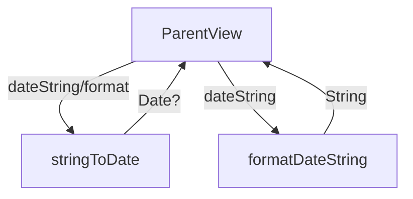

# Date Formatting Functions

## Overview

The `Format.swift` file in the Immotep app contains utility functions for handling date conversions. These functions convert string representations of dates into `Date` objects or reformat them into a specific string format, supporting the app's date-related operations.

---

## Functionality

### `stringToDate(_:format:)`
* **Purpose**: Converts a date string to a `Date` object.
* **Parameters**:
  * `dateString: String`: The input date string to parse.
  * `format: String?` (optional): The date format to use for parsing. Defaults to `"dd/MM/yyyy"` if not provided.
* **Features**:
  * Uses `DateFormatter` to parse the input string.
  * Returns a `Date` object if parsing succeeds, or `nil` if the string is invalid or does not match the format.
* **Usage Example**:
  ```swift
  let date = stringToDate("25/12/2024") // Returns Date object for Dec 25, 2024
  let customDate = stringToDate("2024-12-25", format: "yyyy-MM-dd") // Returns Date object
  ```

### `formatDateString(_:)`
* **Purpose**: Converts an ISO 8601 date string to a formatted date string in `"dd/MM/yyyy"` format.
* **Parameters**:
  * `dateString: String`: The input date string in ISO 8601 format (e.g., `"2024-12-25T10:00:00Z"`).
* **Features**:
  * Uses `ISO8601DateFormatter` to parse the input string with `.withInternetDateTime` option.
  * Converts the parsed `Date` to a string in `"dd/MM/yyyy"` format using `DateFormatter`.
  * Returns `"invalid date"` if the input string cannot be parsed.
* **Usage Example**:
  ```swift
  let formatted = formatDateString("2024-12-25T10:00:00Z") // Returns "25/12/2024"
  let invalid = formatDateString("invalid") // Returns "invalid date"
  ```

---

## Data Flow



---

## Integration

* **Usage**: These functions are likely used in views or view models handling date-related data (e.g., lease dates in `PropertyDetailView` or inventory timestamps).
* **Context**: 
  * `stringToDate` is used to parse user input or API-provided date strings into `Date` objects for internal processing.
  * `formatDateString` is used to display ISO 8601 dates from APIs in a user-friendly format (e.g., for UI display).
* **Assumptions**:
  * The app receives date strings from APIs in ISO 8601 format or user input in `"dd/MM/yyyy"`.
  * The functions are called in contexts like `InventoryViewModel` or UI components displaying dates.

---

## Helper Features

* **Localization**:
  * The output format `"dd/MM/yyyy"` is fixed and not localized, assuming this is the app’s standard date format.
  * The `"invalid date"` string in `formatDateString` is not localized, which may be an oversight for multilingual support.
* **Error Handling**:
  * `stringToDate` returns `nil` for invalid inputs, allowing callers to handle parsing failures.
  * `formatDateString` returns a fallback string (`"invalid date"`) for invalid inputs.
* **Flexibility**:
  * `stringToDate` supports custom formats via the optional `format` parameter, making it versatile for various date string formats.

---

## Notes

* The functions are simple and focused on specific use cases (ISO 8601 parsing and `"dd/MM/yyyy"` formatting).
* Consider adding localization for the `"invalid date"` string in `formatDateString` for consistency with the app’s multilingual support.
* No accessibility or debugging features are included, as these are utility functions for internal use.
* The functions assume valid input formats; additional validation (e.g., regex) could enhance robustness.
