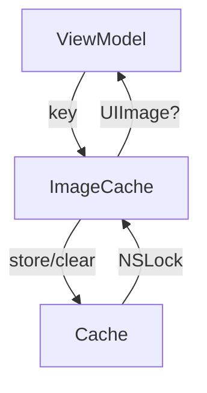

# ImageCache Documentation

## Overview

The `ImageCache.swift` file in the Keyz app provides a thread-safe singleton cache for storing and managing `UIImage` objects, optimizing performance by reducing redundant image loading.

---

## Functionality

### `getImage(forKey:) -> UIImage?`
* **Purpose**: Retrieves a cached `UIImage` for a given key.
* **Parameters**:
  * `key: String`: The unique identifier for the image.
* **Features**:
  * Uses `NSLock` for thread-safe access.
  * Returns the cached `UIImage` or `nil` if not found.
* **Usage Example**:
  ```swift
  let image = ImageCache.shared.getImage(forKey: "img123") // Returns cached UIImage or nil
  ```

### `setImage(_:forKey:)`
* **Purpose**: Stores a `UIImage` in the cache for a given key.
* **Parameters**:
  * `image: UIImage?`: The image to cache (nullable).
  * `key: String`: The unique identifier for the image.
* **Features**:
  * Uses `NSLock` for thread-safe writes.
* **Usage Example**:
  ```swift
  ImageCache.shared.setImage(uiImage, forKey: "img123") // Caches the UIImage
  ```

### `clearCache()`
* **Purpose**: Clears all cached `UIImage` objects.
* **Features**:
  * Uses `NSLock` for thread-safe clearing.
* **Usage Example**:
  ```swift
  ImageCache.shared.clearCache() // Removes all cached images
  ```

---

## Data Flow



---

## Integration

* **Usage**: `ImageCache` is used to cache `UIImage` objects (e.g., property pictures) to avoid reloading from disk or network, likely in views like `PropertyDetailView` or view models like `PropertyViewModel`.
* **Context**:
  * The singleton pattern (`shared`) ensures a single cache instance across the app.
  * Likely integrated with API calls that fetch image data (e.g., `fetchPropertiesPicture` in `PropertyManagementService`).
* **Assumptions**:
  * Keys are unique identifiers (e.g., picture IDs from API responses).
  * Used in contexts where images are frequently displayed, such as property or damage report views.
  * The app converts base64-encoded image data (from API) to `UIImage` before caching.

---

## Helper Features

* **Thread Safety**:
  * Uses `NSLock` for thread-safe reads and writes.
* **Error Handling**:
  * No explicit error handling; assumes valid `UIImage` objects and keys.
* **Performance**:
  * Optimizes performance by caching images in memory, reducing disk or network access.
  * No cache size limit, which could lead to memory issues with large images.
