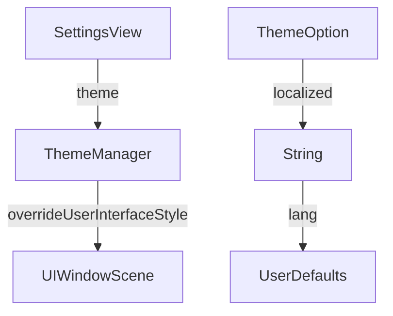

# ThemeManager Documentation

## Overview

The `ThemeManager.swift` file in the Keyz app defines a `ThemeOption` enum and a `ThemeManager` struct to manage the app’s appearance, supporting system, light, and dark themes by adjusting the user interface style.

---

## Functionality

### `ThemeOption`
* **Purpose**: An enum defining available theme options.
* **Cases**:
  * `system`: Uses the device’s system appearance (light or dark).
  * `light`: Forces light mode.
  * `dark`: Forces dark mode.
* **Features**:
  * Conforms to `CaseIterable` for easy iteration in UI (e.g., settings picker).
  * Provides a `localized` property to return the localized string for each case using `String.localized()`.
* **Usage Example**:
  ```swift
  let theme = ThemeOption.light // ThemeOption with rawValue "theme_light"
  print(theme.localized) // Prints localized string (e.g., "Light" or "Clair")
  ```

### `ThemeManager.applyTheme(theme:)`
* **Purpose**: Applies the specified theme to the app’s UI.
* **Parameters**:
  * `theme: String`: The raw value of a `ThemeOption` (e.g., `"theme_light"`).
* **Features**:
  * Marked with `@MainActor` for UI thread safety.
  * Updates the `overrideUserInterfaceStyle` of the root view controller to `.light`, `.dark`, or `.unspecified` based on the theme.
  * Accesses the `UIWindowScene` to apply the theme globally.
* **Usage Example**:
  ```swift
  await ThemeManager.applyTheme(theme: ThemeOption.dark.rawValue) // Sets app to dark mode
  ```

---

## Data Flow



---

## Integration

* **Usage**: 
  * `ThemeOption` is used in settings views to display theme options (e.g., in a picker or menu).
  * `ThemeManager.applyTheme(theme:)` is called when the user selects a theme, updating the app’s appearance.
* **Context**:
  * Likely integrated with a settings view that stores the selected theme in `UserDefaults` or a view model.
  * Relies on `String.localized()` for displaying theme names in the user’s language.
* **Assumptions**:
  * The app uses SwiftUI with UIKit integration (e.g., via `UIWindowScene`) for theme management.
  * The theme setting is persisted elsewhere (e.g., `UserDefaults`) and passed to `applyTheme(theme:)`.
  * The `rootViewController` exists and supports `overrideUserInterfaceStyle`.

---

## Helper Features

* **Localization**:
  * `ThemeOption.localized` uses `String.localized()` to support multilingual theme names.
* **Thread Safety**:
  * `applyTheme(theme:)` is `@MainActor`-annotated to ensure safe UI updates.
* **Error Handling**:
  * No explicit error handling; assumes `UIWindowScene` and `rootViewController` are available.
* **Flexibility**:
  * Supports system, light, and dark themes, aligning with iOS standards.
