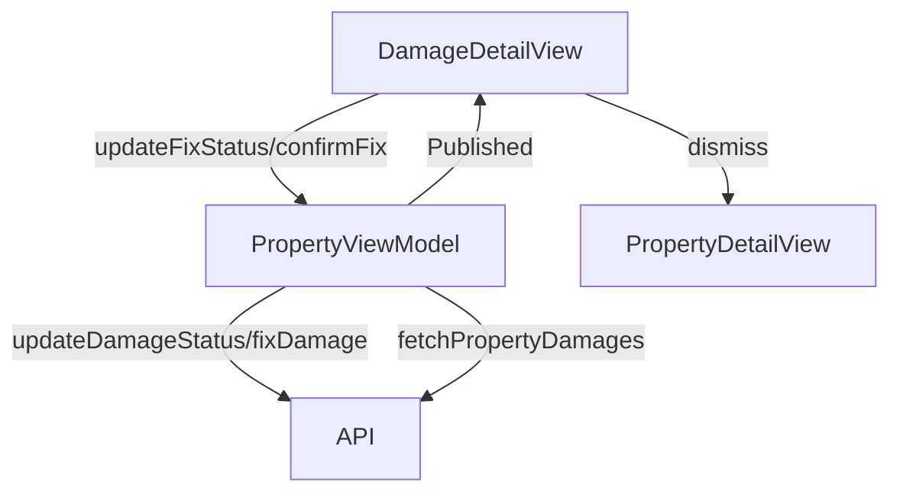

# Damage Detail Screen

## UI Components

* `NavigationStack`: Manages navigation for the screen.
* `TopBar`: Displays the title ("Damage Details") with a back button.
* `ScrollView`: Contains damage details in a vertically scrollable layout.
* `ErrorNotificationView`: Displays error messages when applicable.
* `Button`: For status updates (owner) or confirming fixes (tenant).
* `ConfirmationDialog`: For selecting fix status or confirming fixes.
* `DatePicker`: For selecting a planned fix date (owner-only, presented in a sheet).
* Custom components:
  * Displays damage details: room name, priority, comment, status, pictures, and relevant dates (created, updated, planned fix, fixed).

---

## ViewModel

### `PropertyViewModel`
* Manages:
  * `properties`: List of `Property` objects.
  * `damages`: List of `DamageResponse` objects.
  * `isFetchingDamages`: Tracks damage fetching state.
  * `damagesError`: Stores error messages for damages.
* Functions:
  * `updateDamageStatus()`: Updates damage status (e.g., to "planned" or "fixed") with optional `fixPlannedAt` date.
  * `fixDamage()`: Marks a damage as fixed.
  * `fetchPropertyDamages()`: Refreshes the damage list after status updates.

### State Observed
* `isLoading`, `errorMessage`, `selectedFixStatus`, `showStatusPicker`, `showDatePicker`, `showConfirmFixPicker`, `selectedFixPlannedDate`.

---

## Functionality

* Displays:
  * Damage details: room name, priority (with color-coded badge), comment, status (with color-coded background), pictures (if any), and dates (created, updated, planned fix, fixed).
* Owner actions (when `fixStatus` is "pending" or "planned"):
  * Change status to "In Progress" (sets a planned fix date) or "Fixed" via a confirmation dialog.
  * Select a planned fix date using a `DatePicker` in a sheet.
* Tenant actions (when `fixStatus` is "awaiting_tenant_confirmation"):
  * Confirm the damage is fixed via a confirmation dialog.
* Updates:
  * Calls `updateDamageStatus()` or `fixDamage()` to update the damage status via API.
  * Refreshes damages with `fetchPropertyDamages()` after updates.
  * Dismisses the view on successful update.
* Error handling: Shows `ErrorNotificationView` for API or other errors.

---

## Data Flow

---

## Navigation

* Uses `NavigationStack` for navigation context.
* Back button (`dismiss`): Returns to the previous screen (`PropertyDetailView`).
* No additional navigation destinations; actions are handled within the view via dialogs and sheets.

---

## API Integration

* Endpoints:
  * `/owner/properties/{propertyId}/damages/{damageId}`: For updating damage status or marking as fixed.
* Uses `TokenStorage` for `Bearer` token authentication.
* Handles errors:
  * `401 Unauthorized`: Invalid token.
  * Other errors: Displays localized error messages via `ErrorNotificationView`.

---

## Helper Functions

* `priorityColor(_:)`: Returns a color based on damage priority (e.g., red for "urgent", green for "low").
* `statusColor(_:)`: Returns a color based on damage status (e.g., green for "fixed", red for "pending").
* `formatDateString(_:)`: Converts ISO8601 date strings to a readable format (`dd/MM/yyyy HH:mm`).
* `base64ToImage(_:)`: Converts base64-encoded strings to `UIImage` for displaying damage pictures.
* `canOwnerChangeStatus()`: Determines if the owner can change the damage status (allowed for "pending" or "planned").
