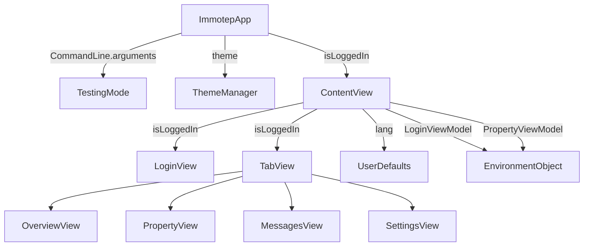

# ImmotepApp and ContentView

## Overview

`ImmotepApp` is the **entry point** of the Keyz app, configuring the app’s lifecycle, theming, and initial view based on testing or login state. `ContentView` serves as the root UI component, managing navigation between the login screen and the main tabbed interface for logged-in users.

---

## UI Components

* **`ImmotepApp`**:
  * The main app struct conforming to `App`, defining the primary `WindowGroup` scene.
  * Conditionally loads `TestImmotepView` for UI testing or `ContentView` for normal operation.
  * Applies the selected theme on appearance using `ThemeManager`.

* **`ContentView`**:
  * A SwiftUI view that switches between `LoginView` (for unauthenticated users) and a `TabView` (for authenticated users).
  * The `TabView` includes:
    * `OverviewView`: Displays a home dashboard.
    * `PropertyView`: Manages property-related features.
    * `MessagesView`: Handles messaging functionality.
    * `SettingsView`: Provides user settings and preferences.
  * Uses `@EnvironmentObject` to inject `LoginViewModel` and `PropertyViewModel` for state management.

* **Environment Objects**:
  * `LoginViewModel`: Manages authentication state (`isLoggedIn`) and user data.
  * `PropertyViewModel`: Handles property-related data and API interactions.

* **TabView Styling**:
  * Applies a custom accent color (`LightBlue`) for tab selection.
  * Uses localized tab titles via `String.localized()`.

---

## Lifecycle Setup

* Executed in `ImmotepApp.init()`:
  1. **Testing Mode Check**:
     * Checks `CommandLine.arguments` for `--UITests` or `-skipLogin`.
     * Disables animations with `UIView.setAnimationsEnabled(false)` for UI testing.

* Executed in `ImmotepApp.body`:
  1. **Theme Application**:
     * Applies the stored theme (via `@AppStorage "theme"`) using `ThemeManager.applyTheme(theme:)` on view appearance.
     * Uses `@MainActor` for thread-safe UI updates.

* Executed in `ContentView`:
  1. **State Initialization**:
     * Initializes `@StateObject` for `LoginViewModel` and `PropertyViewModel`.
     * Uses `@AppStorage` for `isLoggedIn` and `lang` to persist authentication and language settings.
  2. **Navigation Logic**:
     * Displays `LoginView` if `isLoggedIn` is `false`.
     * Displays `TabView` with four tabs if `isLoggedIn` is `true`.

---

## Globals and Environment Objects

### `LoginViewModel`

```swift
class LoginViewModel: ObservableObject
```

* Manages authentication state and user data.
* Injected into `ContentView`, `OverviewView`, `PropertyView`, and `SettingsView` via `.environmentObject`.
* Accessed in views to check `isLoggedIn` or perform login-related actions.

### `PropertyViewModel`

```swift
class PropertyViewModel: ObservableObject
```

* Manages property-related data and API calls (e.g., via `PropertyManagementService`).
* Injected into `PropertyView` via `.environmentObject`.
* Depends on `LoginViewModel` for user context.

### `@AppStorage`

* **`isLoggedIn: Bool`**:
  * Stored in `UserDefaults`, controls whether `LoginView` or `TabView` is shown.
* **`lang: String`**:
  * Stored in `UserDefaults`, used for localization via `String.localized()`.
  * Triggers view refresh with `.id(lang)` when changed.
* **`theme: String`**:
  * Stored in `UserDefaults`, determines the app’s appearance (system, light, or dark).

---

## Data Flow



---

## Localization

* Uses `@AppStorage("lang")` to store the user’s language preference.
* Applies localization to tab titles via `String.localized()` (e.g., `"Overview".localized()`).
* Relies on `Bundle` extensions (see [`Bundle.md`](../utilities/bundle.md)) to load `.lproj` files based on the `lang` setting.
* View refreshes when `lang` changes via `.id(lang)` modifier.

---

## Navigation

* **Root Navigation**:
  * `ImmotepApp` selects between `TestImmotepView` (for UI testing with `-skipLogin`) or `ContentView`.
  * `ContentView` switches between `LoginView` (unauthenticated) and `TabView` (authenticated).

* **TabView Navigation**:
  * Manages four tabs: `OverviewView`, `PropertyView`, `MessagesView`, and `SettingsView`.
  * Uses `@State selectedTab` to track the active tab.
  * Passes `selectedTab` as a binding to `SettingsView` for programmatic tab switching.

* **Dependencies**:
  * All views in `TabView` access `LoginViewModel` and/or `PropertyViewModel` via `@EnvironmentObject`.
  * Likely integrates with `PropertyManagementService` (see [`property_management_api.md`](../utilities/property_management_api.md)) for property-related features.

---

## Testing Support

* **UI Testing Mode**:
  * Enabled with `CommandLine.arguments.contains("--UITests")` or `"-skipLogin"`.
  * Disables animations via `UIView.setAnimationsEnabled(false)` for predictable UI testing.
  * Loads `TestImmotepView` when `-skipLogin` is present, bypassing the login flow.

* **Preview Support**:
  * `ContentView_Previews` provides a preview for `ContentView` in Xcode’s canvas.

---

## Summary

`ImmotepApp` and `ContentView` are responsible for:

✅ Initializing the app with testing mode checks and theme application  
✅ Managing navigation between login and tabbed interfaces  
✅ Providing global state via `LoginViewModel` and `PropertyViewModel`  
✅ Supporting localization with dynamic language switching  
✅ Enabling UI testing with animation disabling and test view  
✅ Bootstrapping the SwiftUI scene with a themed, localized environment  

