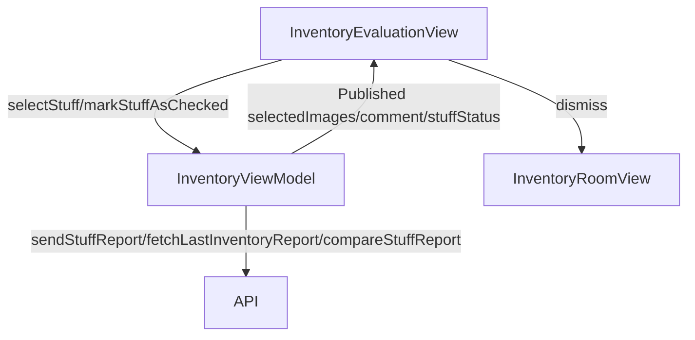

# Inventory Evaluation Screens (Entry and Exit)

## Overview

The `InventoryEntryEvaluationView` and `InventoryExitEvaluationView` are SwiftUI views for evaluating inventory items during entry and exit processes in the Immotep app. Both views share nearly identical UI and functionality, with the primary difference being the exit view's additional step of comparing the report to a previous inventory report. This documentation covers both views, highlighting differences where applicable.

---

## UI Components

* `VStack`: Organizes the layout with a top bar and scrollable content.
* `TopBar`: Displays the title ("Inventory Report") with a back button for navigation.
* `ScrollView`: Contains sections for images, comments, status selection, and actions.
* `PicturesSegment`: Custom view for displaying and managing images (add, replace, delete).
* `TextEditor`: For entering comments about the inventory item.
* `Picker`: Menu-style picker for selecting equipment status (e.g., "broken", "good").
* `Button`: 
  * "Send Report" to submit the inventory evaluation.
  * "Validate" to confirm the report after submission.
* `ErrorNotificationView`: Displays error messages.
* `ProgressView`: Shows a loading indicator during API calls.
* `ImagePicker`: Full-screen cover for selecting images from camera or photo library.
* `ActionSheet`: For image options (replace or delete) in `PicturesSegment`.

---

## ViewModel

### `InventoryViewModel`
* Manages:
  * `selectedImages`: Array of `UIImage` for the inventory item.
  * `comment`: User-entered comment for the inventory item.
  * `stuffStatus`: Selected status of the inventory item (e.g., "not_set", "broken").
  * `selectedInventory`: List of `LocalInventory` objects for the current evaluation.
  * `localRooms`: List of rooms with their inventory items.
  * `selectedRoom`: Currently selected room.
  * `lastReportId`: ID of the last inventory report (used in exit evaluation).
* Functions:
  * `selectStuff(_:)`: Sets the selected inventory item.
  * `markStuffAsChecked(_:)`: Marks an inventory item as checked.
  * `sendStuffReport()`: Sends the inventory report to the API.
  * `fetchLastInventoryReport()`: Fetches the last inventory report (exit view only).
  * `compareStuffReport(oldReportId:)`: Compares the current report to a previous one (exit view only).

### State Observed
* `showSheet`, `sourceType`, `replaceIndex`: For image picker functionality.
* `isLoading`, `showError`, `errorMessage`: For managing API call states and errors.
* `isReportSent`: Tracks whether the report has been sent to show the "Validate" button.

---

## Functionality

* **Purpose**:
  * `InventoryEntryEvaluationView`: For evaluating inventory items during move-in (entry inventory).
  * `InventoryExitEvaluationView`: For evaluating inventory items during move-out, with comparison to a previous report.
* **On Appear**:
  * Initializes `selectedImages`, `comment`, and `stuffStatus` based on the `selectedStuff` (a `LocalInventory` object).
  * Ensures `stuffStatus` is valid, defaulting to "not_set" if invalid.
* **Features**:
  * Users can:
    * Add, replace, or delete images using `PicturesSegment`.
    * Enter a comment in a `TextEditor`.
    * Select a status from a predefined list (e.g., "broken", "good") via a `Picker`.
    * Submit the report with "Send Report" (requires at least one image).
    * Validate the report with "Validate" after submission.
  * Images are selected via camera or photo library using `ImagePicker`.
* **Report Submission**:
  * Calls `markStuffAsChecked(_:)` to mark the item as checked.
  * For entry: Calls `sendStuffReport()` to submit the report.
  * For exit: Fetches the last report with `fetchLastInventoryReport()` and compares it using `compareStuffReport(oldReportId:)`.
  * On success, sets `isReportSent` to true, showing the "Validate" button.
  * On failure, displays localized error messages (e.g., 404, 403, invalid image format).
* **Validation**:
  * Updates the `selectedInventory` and `localRooms` with the checked status, images, status, and comment.
  * Dismisses the view to return to the previous screen.

---

## Differences Between Entry and Exit Views

* **Report Submission**:
  * **Entry**: Directly sends the report via `sendStuffReport()`.
  * **Exit**: Fetches the last report and compares it using `compareStuffReport(oldReportId:)`, requiring a previous report to proceed.
* **Error Handling**:
  * Exit view includes specific error handling for missing previous reports ("No previous inventory report found for comparison").

---

## Data Flow

---

## Navigation

* Uses `NavigationStack` for navigation context.
* Back button (`dismiss`): Returns to the previous screen (`InventoryRoomView`).
* `ImagePicker`: Presented as a full-screen cover for image selection.
* `navigationBarBackButtonHidden(true)`: Custom back button in `TopBar` used instead.

---

## API Integration

* Endpoints (assumed):
  * `/inventory/report`: For sending inventory reports (`sendStuffReport()`).
  * `/inventory/last`: For fetching the last inventory report (exit view only).
  * `/inventory/compare`: For comparing exit reports with previous ones (exit view only).
* Uses `TokenStorage` for `Bearer` token authentication (assumed, as in other views).
* Handles errors:
  * `404`: Property or report not found.
  * `403`: No permission to access the property.
  * `400`: Invalid request (e.g., invalid image format).
  * Custom: No active lease or missing previous report (exit view).

---

## Helper Functions and Components

* **Helper Functions**:
  * `createImagePickerBinding()`: Creates a binding for `ImagePicker` to append or replace images.
  * `showImagePickerOptions(replaceIndex:)`: Shows an action sheet for selecting image source (camera or photo library).
  * `markStuffAsCheckedAndSendReport()`: Handles report submission and error handling.
  * `validateReport()`: Updates inventory data and dismisses the view.
* **PicturesSegment**:
  * Displays a horizontal scrollable list of images.
  * Allows adding new images or tapping existing ones for replace/delete options via an `ActionSheet`.
  * Requires at least one image to enable the "Send Report" button.

---
