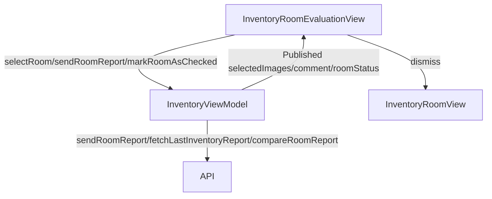

# Inventory Room Evaluation Screens (Entry and Exit)

## Overview

The `InventoryRoomEvaluationView` and `InventoryRoomExitEvaluationView` are SwiftUI views in the Keyz app for evaluating the condition of a room during inventory processes (entry and exit). Both views share nearly identical UI and functionality, with the key difference being that the exit evaluation includes a comparison with a previous inventory report. This documentation covers both views, highlighting differences where applicable.

---

## UI Components

* `VStack`: Organizes the layout with a top bar and scrollable content.
* `TopBar`: Displays the title ("Room Analysis") with a custom back button.
* `ScrollView`: Contains sections for images, comments, status selection, and action buttons.
* `PicturesSegment`: Custom view for managing images (add, replace, delete).
* `TextEditor`: For entering comments about the room's condition.
* `Picker`: Menu-style picker for selecting room status (e.g., "broken", "good").
* `Button`: 
  * "Send Room Report" to submit the room evaluation (requires at least one image).
  * "Validate" to confirm the report after submission.
* `ErrorNotificationView`: Displays error messages.
* `ProgressView`: Shows a loading indicator during API calls.
* `ImagePicker`: Full-screen cover for selecting images from camera or photo library.
* `ActionSheet`: For image options (replace or delete) in `PicturesSegment`.

---

## ViewModel

### `InventoryViewModel`
* Manages:
  * `selectedImages`: Array of `UIImage` for the room.
  * `comment`: User-entered comment for the room.
  * `roomStatus`: Selected status of the room (e.g., "not_set", "broken").
  * `localRooms`: List of rooms with their inventory items.
  * `selectedRoom`: Currently selected room.
  * `lastReportId`: ID of the last inventory report (used in exit evaluation).
* Functions:
  * `selectRoom(_:)`: Sets the selected room.
  * `sendRoomReport()`: Sends the room report to the API (entry view).
  * `fetchLastInventoryReport()`: Fetches the last inventory report (exit view).
  * `compareRoomReport(oldReportId:)`: Compares the current room report to a previous one (exit view).
  * `markRoomAsChecked(_:)`: Marks the room as checked.

### State Observed
* `showSheet`, `sourceType`, `replaceIndex`: For image picker functionality.
* `isLoading`, `showError`, `errorMessage`: For managing API call states and errors.
* `isReportSent`: Tracks whether the report has been sent to show the "Validate" button.

---

## Functionality

* **Purpose**:
  * `InventoryRoomEvaluationView`: Evaluates a room's condition during move-in (entry inventory).
  * `InventoryRoomExitEvaluationView`: Evaluates a room's condition during move-out, with comparison to a previous report.
* **On Appear**:
  * Initializes `selectedImages`, `comment`, and `roomStatus` based on the `selectedRoom` (a `LocalRoom` object).
  * Ensures `roomStatus` is valid, defaulting to "not_set" if invalid.
* **Features**:
  * Users can:
    * Add, replace, or delete images using `PicturesSegment`.
    * Enter a comment in a `TextEditor`.
    * Select a status from a predefined list (e.g., "broken", "good") via a `Picker`.
    * Submit the report with "Send Room Report" (requires at least one image).
    * Validate the report with "Validate" after submission.
  * Images are selected via camera or photo library using `ImagePicker`.
* **Report Submission**:
  * **Entry**: Calls `sendRoomReport()` to submit the room report.
  * **Exit**: Calls `fetchLastInventoryReport()` to retrieve the last report, then `compareRoomReport(oldReportId:)` to compare with the previous report.
  * On success, sets `isReportSent` to true, showing the "Validate" button.
  * On failure, displays localized error messages (e.g., 404, 403, invalid image format).
* **Validation**:
  * Updates `localRooms` and `selectedRoom` with the checked status, images, status, and comment.
  * Calls `markRoomAsChecked(_:)` to update the room's checked status.
  * Dismisses the view to return to the previous screen.

---

## Differences Between Entry and Exit Views

* **Report Submission**:
  * **Entry**: Directly sends the room report via `sendRoomReport()`.
  * **Exit**: Fetches the last report with `fetchLastInventoryReport()` and compares it using `compareRoomReport(oldReportId:)`, requiring a previous report.
* **Error Handling**:
  * Exit view includes specific error handling for missing previous reports ("No previous inventory report found for comparison").

---

## Data Flow

---

## Navigation

* Uses `NavigationStack` for navigation context.
* Back button (`dismiss`): Returns to the previous screen (`InventoryRoomView`).
* `ImagePicker`: Presented as a full-screen cover for image selection.
* `navigationBarBackButtonHidden(true)`: Custom back button in `TopBar` used instead.

---

## API Integration

* Endpoints (assumed):
  * `/inventory/room/report`: For sending room reports (`sendRoomReport()`).
  * `/inventory/last`: For fetching the last inventory report (exit view).
  * `/inventory/room/compare`: For comparing room reports with previous ones (exit view).
* Uses `TokenStorage` for `Bearer` token authentication (assumed, as in other views).
* Handles errors:
  * `404`: Property or report not found.
  * `403`: No permission to access the property.
  * `400`: Invalid request (e.g., invalid image format).
  * Custom: No active lease or missing previous report (exit view).

---

## Helper Functions and Components

* **Helper Functions**:
  * `createImagePickerBinding()`: Creates a binding for `ImagePicker` to append or replace images.
  * `showImagePickerOptions(replaceIndex:)` / `showImageSelection(replaceIndex:)`: Shows an action sheet for selecting image source (camera or photo library).
  * `sendRoomReport()` / `sendRoomComparisonReport()`: Handles report submission and error handling.
  * `validateReport()`: Updates room data and dismisses the view.
* **PicturesSegment**:
  * Displays a horizontal scrollable list of images.
  * Allows adding new images or tapping existing ones for replace/delete options via an `ActionSheet`.
  * Requires at least one image to enable the "Send Room Report" button.

---
