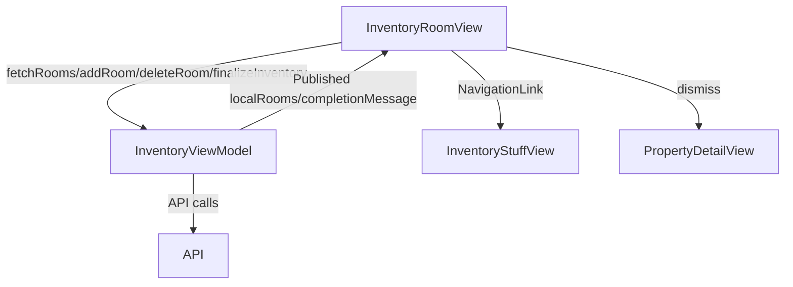

# Inventory Room View

## Overview

The `InventoryRoomView` is a SwiftUI view in the Keyz app that displays a list of rooms for inventory evaluation during entry or exit processes. It allows users to add, delete, and navigate to rooms for detailed analysis, and finalize the inventory when all rooms are completed.

---

## UI Components

* `VStack`: Organizes the layout with a top bar, room list, add room button, and finalize button.
* `TopBar`: Displays the app title ("Keyz") with a custom back button.
* `RoomListView`: Custom view displaying a list of rooms with navigation to `InventoryStuffView`.
* `AddRoomButton`: Button to trigger adding a new room.
* `Button`: "Finalize Inventory" button, shown when all rooms are completed.
* `CustomAlertWithTextAndDropdown`: Alert for adding a room with name and type inputs.
* `CustomAlertTwoButtons`: Alerts for confirming room deletion and inventory completion.
* `ErrorNotificationView`: Displays error messages.
* `List`: Displays rooms in a plain list style with swipe actions for deletion.

---

## ViewModel

### `InventoryViewModel`
* Manages:
  * `localRooms`: List of `LocalRoom` objects.
  * `selectedRoom`: Currently selected room.
  * `isEntryInventory`: Indicates whether the inventory is for entry or exit.
  * `completionMessage`: Message displayed upon inventory finalization.
  * `errorMessage`: Stores error messages from API calls.
* Functions:
  * `fetchRooms()`: Fetches the list of rooms for the property.
  * `addRoom(name:type:)`: Adds a new room to the inventory.
  * `deleteRoom(_:)`: Deletes a specified room.
  * `areAllRoomsCompleted()`: Checks if all rooms are marked as checked.
  * `finalizeInventory()`: Finalizes the inventory process.
  * `resetInventory()`: Resets inventory data after completion.
  * `onDocumentsRefreshNeeded`: Callback to refresh documents and inventory status.

### State Observed
* `@AppStorage`:
  * `selectedTheme`: Stores the selected theme ("System", "Light", "Dark").
* `@State`:
  * `newRoomName`: Input for the new room's name.
  * `showAddRoomAlert`: Toggles the add room alert.
  * `showDeleteConfirmationAlert`, `roomToDelete`: Manages room deletion confirmation.
  * `showCompletionMessage`: Toggles the inventory completion alert.
  * `showError`, `errorMessage`: For error feedback.

---

## Functionality

* **Purpose**: Manages room-level inventory evaluation by listing rooms, allowing room addition/deletion, and finalizing the inventory.
* **On Appear**:
  * Calls `fetchRooms()` to load the list of rooms for the property.
* **Features**:
  * Displays a list of rooms via `RoomListView`, each navigable to `InventoryStuffView` for detailed analysis.
  * Rooms show indicators for checked status (`checkmark`), images (`photo`), and comments (`text.bubble`).
  * Users can:
    * Add a room via `AddRoomButton`, which triggers `CustomAlertWithTextAndDropdown` for entering room name and type.
    * Delete a room via swipe action, confirmed with `CustomAlertTwoButtons`.
    * Finalize the inventory with the "Finalize Inventory" button when all rooms are completed (`areAllRoomsCompleted()`).
  * Finalization:
    * Calls `finalizeInventory()` to complete the inventory process.
    * Shows a completion message via `CustomAlertTwoButtons`.
    * Resets inventory data and triggers `onDocumentsRefreshNeeded` callback.
    * Dismisses the view on completion.
* **Error Handling**:
  * Displays localized error messages for failed API calls (e.g., adding rooms, finalizing inventory) via `ErrorNotificationView`.

---

## Data Flow

---

## Navigation

* Uses `NavigationStack` for navigation context.
* Back button (`dismiss`): Returns to the previous screen (`PropertyDetailView`).
* `NavigationLink` in `RoomListView`: Navigates to `InventoryStuffView` for each room.
* `navigationBarBackButtonHidden(true)`: Custom back button in `TopBar` used instead.

---

## API Integration

* Endpoints (assumed):
  * `/inventory/rooms`: For fetching rooms (`fetchRooms()`).
  * `/inventory/rooms/add`: For adding a new room (`addRoom(name:type:)`).
  * `/inventory/rooms/delete`: For deleting a room (`deleteRoom(_:)`).
  * `/inventory/finalize`: For finalizing the inventory (`finalizeInventory()`).
* Uses `TokenStorage` for `Bearer` token authentication (assumed, as in other views).
* Handles errors:
  * Displays localized error messages via `ErrorNotificationView` for API failures (e.g., network issues, permission errors).

---

## Helper Components

* **RoomListView**:
  * Displays a list of `LocalRoom` objects with `RoomCard` for each room.
  * Supports swipe-to-delete with a confirmation alert.
  * Navigates to `InventoryStuffView` for room-specific inventory evaluation.
* **AddRoomButton**:
  * Triggers the add room alert with a `plus.circle` icon.
* **RoomCard**:
  * Displays room name and indicators for checked status, images, and comments.
* **CustomAlertWithTextAndDropdown**:
  * Used for adding rooms with name and type inputs.
* **CustomAlertTwoButtons**:
  * Used for delete confirmation and inventory completion messages.

---

## Notes

* The view supports both entry and exit inventory processes, distinguished by `isEntryInventory` in the view model.
* Accessibility identifiers (`AddRoomAlert`, `DeleteRoomAlert`) are provided for alerts.
* Localization is applied to all user-facing text.
* The "Finalize Inventory" button is conditionally shown based on room completion status.
* The view integrates with `InventoryStuffView` for item-level evaluations within each room.
