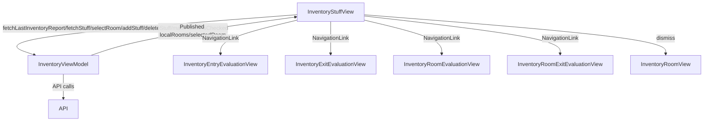

# Inventory Stuff View

## Overview

The `InventoryStuffView` is a SwiftUI view in the Immotep app that displays a list of inventory items (stuff) within a selected room for evaluation during entry or exit inventory processes. It allows users to add, delete, and evaluate inventory items, and navigate to room-level analysis or confirm the room's completion.

---

## UI Components

* `VStack`: Organizes the layout with a top bar, list of inventory items, and action buttons.
* `TopBar`: Displays the app title ("Keyz") with a custom back button.
* `List`: Displays a list of `LocalInventory` items with navigation to evaluation views.
* `StuffCard`: Custom view for each inventory item, showing name, checked status, and indicators for images and comments.
* `Button`:
  * "Add an element" button to trigger adding a new inventory item.
  * "Confirm" button to mark the room as checked (shown when room is completed).
  * "Analyze Room" button to navigate to room evaluation (entry or exit).
* `CustomAlertWithTwoTextFields`: Alert for adding a new inventory item with name and quantity inputs.
* `CustomAlertTwoButtons`: Alert for confirming item deletion.
* `ErrorNotificationView`: Displays error messages.
* `NavigationLink`: Navigates to `InventoryEntryEvaluationView` or `InventoryExitEvaluationView` for item evaluation, and `InventoryRoomEvaluationView` or `InventoryRoomExitEvaluationView` for room analysis.

---

## ViewModel

### `InventoryViewModel`
* Manages:
  * `localRooms`: List of `LocalRoom` objects, each containing a list of `LocalInventory` items.
  * `selectedRoom`: Currently selected room.
  * `checkedStuffStatus`: Dictionary tracking checked status of inventory items.
  * `isEntryInventory`: Indicates whether the inventory is for entry or exit.
  * `errorMessage`: Stores error messages from API calls.
* Functions:
  * `fetchLastInventoryReport()`: Fetches the last inventory report (exit inventory only).
  * `fetchStuff(_:)`: Fetches inventory items for a specified room.
  * `selectRoom(_:)`: Sets the selected room.
  * `addStuff(name:quantity:to:)`: Adds a new inventory item to a room.
  * `deleteStuff(_:from:)`: Deletes an inventory item from a room.
  * `markRoomAsChecked(_:)`: Marks a room as checked.

### State Observed
* `selectedRoom`: The currently selected `LocalRoom`.
* `showAddStuffAlert`: Toggles the add item alert.
* `showDeleteConfirmationAlert`, `stuffToDelete`: Manages item deletion confirmation.
* `showError`, `errorMessage`: For error feedback.

---

## Functionality

* **Purpose**: Manages inventory item evaluation within a specific room, allowing users to add, delete, evaluate items, and analyze or confirm the room.
* **On Appear**:
  * For exit inventory, calls `fetchLastInventoryReport()` to load the last report.
  * Sets `selectedRoom` to the room matching `roomId`.
  * Fetches inventory items for the room if empty (`fetchStuff(_:)`).
  * Selects the room in the view model (`selectRoom(_:)`).
* **Features**:
  * Displays a list of inventory items (`LocalInventory`) in a `List` with `StuffCard` for each item.
  * Each item is navigable to:
    * `InventoryEntryEvaluationView` (entry inventory).
    * `InventoryExitEvaluationView` (exit inventory).
  * Users can:
    * Add an item via `CustomAlertWithTwoTextFields` (name and quantity).
    * Delete an item via swipe action, confirmed with `CustomAlertTwoButtons`.
    * Analyze the room via `InventoryRoomEvaluationView` (entry) or `InventoryRoomExitEvaluationView` (exit) if items exist and the room is not yet checked.
    * Confirm the room as checked (`markRoomAsChecked(_:)`) if all items are checked.
* **Error Handling**:
  * Displays localized error messages for failed API calls (e.g., adding or deleting items) via `ErrorNotificationView`.
* **Room Completion**:
  * Shows "Confirm" button when the room is checked (`selectedRoom.checked`).
  * Shows "Analyze Room" button if items exist and the room is not yet checked.

---

## Data Flow

---

## Navigation

* Uses `NavigationStack` for navigation context.
* Back button (`dismiss`): Returns to the previous screen (`InventoryRoomView`).
* `NavigationLink`:
  * Navigates to `InventoryEntryEvaluationView` or `InventoryExitEvaluationView` for item evaluation.
  * Navigates to `InventoryRoomEvaluationView` or `InventoryRoomExitEvaluationView` for room analysis.
* `navigationBarBackButtonHidden(true)`: Custom back button in `TopBar` used instead.

---

## API Integration

* Endpoints (assumed):
  * `/inventory/last`: For fetching the last inventory report (exit inventory).
  * `/inventory/rooms/{roomId}/stuff`: For fetching inventory items (`fetchStuff(_:)`).
  * `/inventory/stuff/add`: For adding a new inventory item (`addStuff(name:quantity:to:)`).
  * `/inventory/stuff/delete`: For deleting an inventory item (`deleteStuff(_:from:)`).
  * `/inventory/rooms/check`: For marking a room as checked (`markRoomAsChecked(_:)`).
* Uses `TokenStorage` for `Bearer` token authentication (assumed, as in other views).
* Handles errors:
  * Displays localized error messages via `ErrorNotificationView` for API failures.

---

## Helper Components

* **StuffCard**:
  * Displays the inventory item name and indicators for checked status (`checkmark`), images (`photo`), and comments (`text.bubble`).
* **addStuffButton**:
  * Triggers the add item alert with a `plus.circle` icon.
* **confirmButton**:
  * Marks the room as checked and dismisses the view.
* **analyzeRoomButton**:
  * Navigates to room evaluation (entry or exit).
* **CustomAlertWithTwoTextFields**:
  * Used for adding items with name and quantity inputs.
* **CustomAlertTwoButtons**:
  * Used for delete confirmation.

---

## Notes

* The view supports both entry and exit inventory processes, determined by `isEntryInventory`.
* Accessibility identifiers (`AddStuffAlert`, `DeleteStuffAlert`) are provided for alerts.
* Localization is applied to all user-facing text.
* The view updates `selectedRoom` when `localRooms` changes to reflect real-time updates.
* The "Confirm" button is shown only when the room is marked as checked, ensuring all items are evaluated first.
