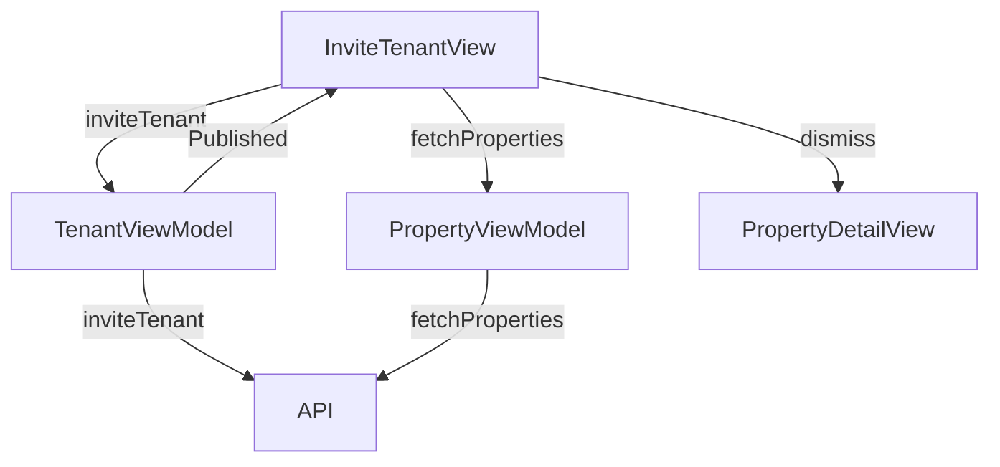

# Invite Tenant Screen

## UI Components

* `NavigationStack`: Manages navigation for the screen.
* `Form`: Contains fields for tenant email, start date, and optional end date.
* `TextField`: For entering the tenant's email address.
* `Button`: For selecting start and end dates, sending the invitation, and canceling.
* `DatePicker`: Presented in sheets for selecting start and end dates.
* `ErrorNotificationView`: Displays success or error messages.
* Toolbar:
  * `Cancel` button to dismiss the view.

---

## ViewModel

### `TenantViewModel`
* Manages:
  * Tenant-related operations, including sending invitations.
* Functions:
  * `inviteTenant()`: Sends an invitation to a tenant with the specified email, start date, and optional end date.

### `PropertyViewModel`
* Manages:
  * `properties`: List of `Property` objects.
* Functions:
  * `fetchProperties()`: Refreshes the property list after sending an invitation.

### State Observed
* `email`, `startDate`, `endDate`: Form input states.
* `showStartDatePicker`, `showEndDatePicker`, `tempEndDate`, `didCancelEndDate`: For managing date picker interactions.
* `showError`, `errorMessage`, `successAlert`: For error and success feedback.

---

## Functionality

* Displays a form for inviting a tenant to a property, with fields for:
  * Tenant email (validated for `@` symbol).
  * Start date (required, defaults to today).
  * End date (optional, must be on or after start date).
* Date selection:
  * Start date: Selected via a `DatePicker` in a medium-sized sheet, restricted to today or later.
  * End date: Optional, selected via a `DatePicker` in a medium-sized sheet, restricted to start date or later.
  * Resets end date if start date is changed to a later date.
* On "Send Invitation" button press:
  * Calls `inviteTenant()` to send the invitation via API.
  * Refreshes properties with `fetchProperties()`.
  * Shows a success message and dismisses the view after 2 seconds on success.
  * Shows an error message for failures (e.g., invalid email, API errors).
* "Cancel" button dismisses the view without sending an invitation.

---

## Data Flow

---

## Navigation

* Uses `NavigationStack` for navigation context.
* `dismiss()`: Returns to the previous screen (`PropertyDetailView`) on cancel or successful invitation.
* `DatePicker` sheets: Presented for selecting start and end dates with `.medium` detent and drag indicator.

---

## API Integration

* Endpoint: Likely `/owner/properties/{propertyId}/invite` (not explicitly shown) for sending tenant invitations.
* Uses `TokenStorage` for `Bearer` token authentication (assumed, as in other views).
* Handles errors:
  * Displays localized error messages via `ErrorNotificationView` for API failures.

---

## Helper Functions

* `dateFormatter`: Formats dates for display in a medium date style (no time).
* `onChange(of: startDate)`: Ensures end date is reset if start date becomes later than the current end date.
