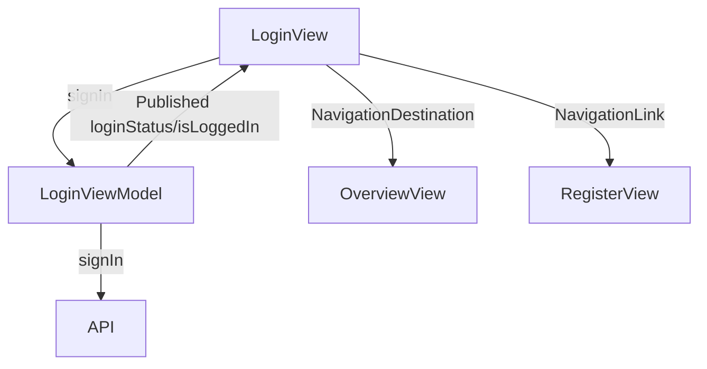

# Login Screen

## UI Components

* `NavigationStack`: Manages navigation for the screen.
* `VStack`: Organizes the layout with a logo, title, subtitle, and form.
* `CustomTextInput`: Text fields for email and password.
* `Button`:
  * Checkbox for "Keep me signed in" option.
  * "Forgot password?" button (currently non-functional).
  * "Sign In" button for submitting the login.
  * "Sign Up" link for navigating to the registration screen.
* `ErrorNotificationView`: Displays error messages.
* `ProgressView`: Shows a loading indicator during login.
* `Image`: Displays the "KeyzLogo" in the top bar.

---

## ViewModel

### `LoginViewModel`
* Manages:
  * `model`: Contains login data (`email`, `password`, `keepMeSignedIn`).
  * `isLoggedIn`: Tracks login status.
  * `loginStatus`: Stores the result of the login attempt (e.g., "Login successful!" or error messages).
* Functions:
  * `validateFields()`: Checks if email and password are filled.
  * `signIn()`: Sends login credentials to the API for authentication.

### State Observed
* `showError`, `errorMessage`, `isLoading`: For managing UI feedback.
* `isLoggedIn`, `keepMeSignedIn`: Stored in `@AppStorage` for persistent login state.
* Observes `viewModel.loginStatus` for login outcomes.

---

## Functionality

* Displays a form for user login with fields for:
  * Email (required).
  * Password (required).
  * "Keep me signed in" checkbox.
* On "Sign In" button press:
  * Validates that email and password are non-empty using `validateFields()`.
  * Shows a loading indicator (`ProgressView`) during the API call.
  * Calls `signIn()` to authenticate via API.
  * On success:
    * Sets `isLoggedIn` to true, triggering navigation to `OverviewView`.
    * Clears error state.
  * On failure:
    * Displays an error message via `ErrorNotificationView` based on `loginStatus`.
* "Sign Up" link navigates to `RegisterView`.
* "Forgot password?" button is present but non-functional.

---

## Data Flow

---

## Navigation

* Uses `NavigationStack` for navigation context.
* `NavigationDestination`: Navigates to `OverviewView` when `isLoggedIn` is true.
* `NavigationLink`: Provides a link to `RegisterView` for new users.
* `navigationBarBackButtonHidden(true)`: Prevents back navigation, as this is typically an entry point.

---

## API Integration

* Endpoint: Likely `/login` or similar (not explicitly shown) for user authentication.
* Uses `TokenStorage` for managing authentication tokens post-login (assumed, as in other views).
* Handles errors:
  * Displays localized error messages via `ErrorNotificationView` based on `loginStatus`.

---

## Helper Features

* Input validation: Disables "Sign In" button if email or password is empty.
* Accessibility: Identifier (`signUpLink`) for the "Sign Up" link for testing and accessibility.
* Localization: All text is localized using `.localized()` for multilingual support.
* Animation: Subtle scale effect on the "Sign In" button when loading.
* Persistent state: Uses `@AppStorage` for `isLoggedIn` and `keepMeSignedIn` to retain login preferences.
