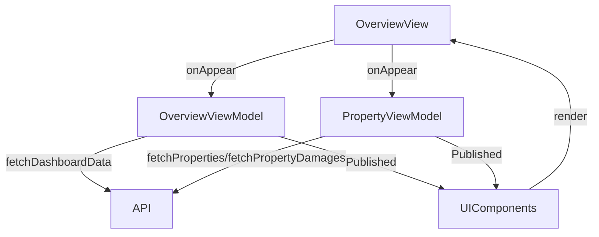

# Overview Screen

## UI Components

* `NavigationStack`: Wraps the screen for navigation.
* `TopBar`: Displays the app title ("Keyz").
* `ProgressView`: Full-screen loading indicator during data fetch.
* `ErrorNotificationView`: Shows error messages when they occur.

### Widgets

All widgets use SwiftUI `VStack` or `LazyVGrid` for layout and are styled with:
* `background(Color("basicWhiteBlack"))`
* `cornerRadius(12)`
* `shadow` for visual depth.

#### Specific Widgets
* `WelcomeWidget`: Shows a personalized welcome message with the user's first name.
* `RemindersWidget`: Displays up to 3 reminders with clickable links to properties.
* `PropertiesWidget`: Shows property stats (total, occupied, available, archived, pending invites) and a recent property.
* `TenantPropertyWidget`: Displays tenant's property details (name, address, rent, lease dates, area, deposit).
* `DamagesWidget`: Shows open damage stats (total, urgent, high, medium, low, planned) and up to 3 pending damages.
* `MessagesWidget`: Placeholder for future messaging functionality beoord

---

## ViewModel

### `OverviewViewModel`
* Manages:
  * `dashboardData`: Stores `DashboardResponse` (reminders, properties, damages).
  * `isLoading`: Controls `ProgressView` visibility.
  * `errorMessage`: Displays errors via `ErrorNotificationView`.
* Functions:
  * `fetchDashboardData()`: Fetches dashboard data for owners via API.

### `PropertyViewModel`
* Manages:
  * `properties`: List of properties.
  * `isFetchingDamages`: Tracks damage fetching state.
  * `damagesError`: Stores damage-related errors.
* Functions:
  * `fetchPropertyById()`: Fetches property details.
  * `fetchPropertyDamages()`: Fetches open damages.
  * `fetchPropertyRooms()`: Fetches room details.
  * `fetchPropertyDocuments()`: Fetches property documents.
  * `__fetchDamageByID()`: Fetches specific damage details.

### State Observed
* `dashboardData`, `properties`, `isLoading`, `isFetchingDamages`, `errorMessage`, `damagesError`.

---

## Functionality
* On appear:
  * Loads user data via `loginViewModel.loadUser()`.
  * Fetches dashboard data for owners or tenant data based on `userRole`.
* Displays:
  * Owner: `WelcomeWidget`, `RemindersWidget`, `PropertiesWidget`, `DamagesWidget`.
  * Tenant: `WelcomeWidget`, `TenantPropertyWidget`, `DamagesWidget`, `MessagesWidget`.
* Error handling: Shows `ErrorNotificationView` for errors.
* Navigation: To `PropertyDetailView` or `DamageDetailView` via bindings.

---

## Data Flow

---

## Navigation
* Uses `NavigationStack` for navigation to:
  * `PropertyDetailView`: For property details.
  * `DamageDetailView`: For damage details.
* Binds `navigateToProperty` and `navigateToDamage` for navigation triggers.

---

## API Integration
* `OverviewViewModel`:
  * Calls `/owner/dashboard/` endpoint with `lang` query parameter.
  * Uses `TokenStorage` for authentication.
* `PropertyViewModel`:
  * Fetches properties, damages, rooms, and documents via API.
* Both handle `401 Unauthorized` errors and use safe exception handling.
