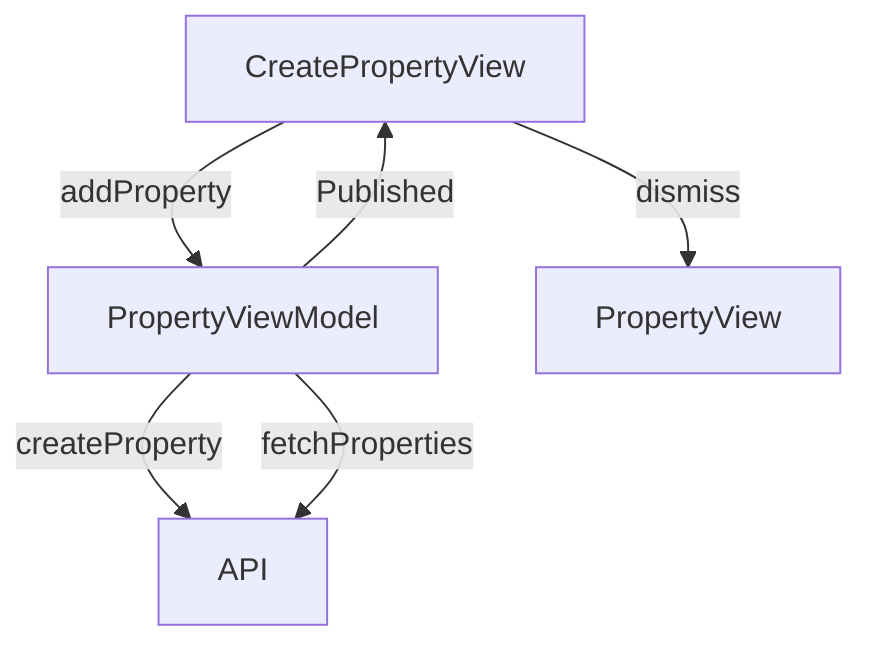

# Create Property Screen

## UI Components

* `NavigationStack`: Manages navigation for the screen.
* `TopBar`: Displays the title ("New Property").
* `Form`: Contains input fields for property details and image selection.
* `Image`: Displays the selected or default property image, clickable to change.
* `CustomTextInput`: Text fields for name, address, city, postal code, and country.
* `CustomTextInputNB`: Numeric fields for monthly rent, deposit, and surface area.
* `ErrorNotificationView`: Shows error or success messages.
* `Button`: "Cancel" and "Add Property" buttons for form submission.

---

## ViewModel

### `PropertyViewModel`
* Manages:
  * `properties`: List of `Property` objects.
* Functions:
  * `createProperty()`: Creates a new property via API.
  * `fetchProperties()`: Refreshes the property list after creation.

### State Observed
* None directly in the view, but updates `properties` in `PropertyViewModel` after creation.

---

## Functionality

* Displays a form for entering property details (name, address, city, postal code, country, monthly rent, deposit, surface area).
* Allows image selection via camera or photo library using `ImagePicker`.
* On "Add Property" button press:
  * Constructs a `Property` object with input data.
  * Calls `createProperty()` to send data to the API.
  * Shows success message and dismisses the view on success.
  * Shows error message for failures (e.g., duplicate property or API errors).
* "Cancel" button dismisses the view without saving.

---

## Data Flow

---

## Navigation

* Uses `NavigationStack` for navigation context.
* `dismiss()`: Returns to the previous screen (e.g., `PropertyView`) on cancel or successful creation.
* `ImagePicker`: Presented as a full-screen cover for image selection.

---

## API Integration

* Endpoint: `/owner/properties/` for creating a new property.
* Uses `TokenStorage` for `Bearer` token authentication.
* Handles errors:
  * `401 Unauthorized`: Invalid token.
  * `409 Conflict`: Duplicate property.
  * Other errors: Generic failure with localized message.
