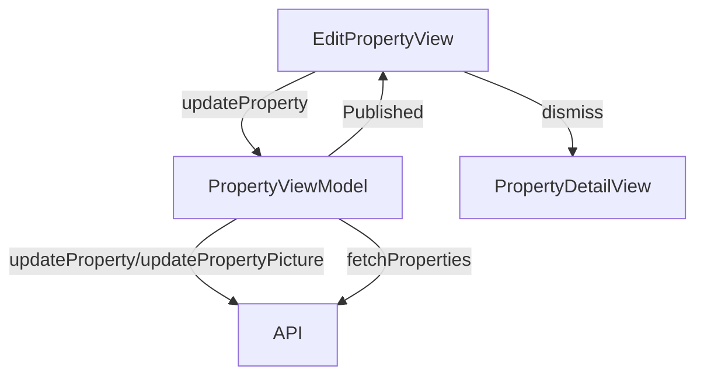

# Edit Property Screen

## UI Components

* `NavigationStack`: Manages navigation for the screen.
* `Form`: Contains input fields for editing property details and image selection.
* `Image`: Displays the current or default property image, clickable to change.
* `CustomTextInput`: Text fields for name, address, city, postal code, and country.
* `CustomTextInputNB`: Numeric fields for monthly rent, deposit, and surface area.
* `ErrorNotificationView`: Shows error or success messages.
* `Button`: "Cancel" and "Save Changes" buttons for form submission.
* `ImagePicker`: Full-screen cover for selecting an image from camera or photo library.

---

## ViewModel

### `PropertyViewModel`
* Manages:
  * `properties`: List of `Property` objects.
* Functions:
  * `updateProperty()`: Updates the property details via API.
  * `updatePropertyPicture()`: Updates the property image if changed.
  * `fetchProperties()`: Refreshes the property list after updates (called internally by `updateProperty()`).

### State Observed
* `name`, `address`, `city`, `postalCode`, `country`, `photo`, `monthlyRent`, `deposit`, `surface`: Local state for form inputs.
* `showError`, `errorMessage`, `successAlert`: For error and success feedback.
* `showSheet`, `sourceType`: For image picker presentation.

---

## Functionality

* Displays a form pre-filled with the current property details (name, address, city, postal code, country, monthly rent, deposit, surface area, and photo).
* Allows image updates via camera or photo library using `ImagePicker`.
* On "Save Changes" button press:
  * Constructs an updated `Property` object with form data, preserving unchanged fields (e.g., `id`, `ownerID`, `isAvailable`, `tenantName`, `leaseId`, `documents`, `rooms`).
  * Calls `updateProperty()` to send updated data to the API.
  * If the photo is changed, calls `updatePropertyPicture()` and clears the image cache.
  * Updates the bound `property` with the refreshed data.
  * Shows a success message and dismisses the view after 2 seconds on success.
  * Shows an error message for failures (e.g., invalid token, API errors).
* "Cancel" button dismisses the view without saving.

---

## Data Flow

---

## Navigation

* Uses `NavigationStack` for navigation context.
* `dismiss()`: Returns to the previous screen (`PropertyDetailView`) on cancel or successful update.
* `ImagePicker`: Presented as a full-screen cover for image selection.

---

## API Integration

* Endpoints:
  * `/owner/properties/{id}`: For updating property details.
  * `/owner/properties/{id}/picture`: For updating the property image.
* Uses `TokenStorage` for `Bearer` token authentication.
* Handles errors:
  * `401 Unauthorized`: Invalid token ("Failed to retrieve token").
  * Other errors: Displays localized error messages via `ErrorNotificationView`.

---

## Helper Functions

* `showImagePickerOptions()`: Presents an action sheet for selecting the image source (camera or photo library).
