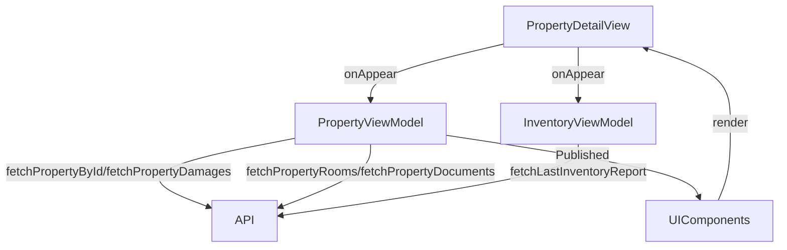

# Property Detail Screen

## UI Components

* `NavigationStack`: Manages navigation for the screen.
* `TopBar`: Displays the app title ("Keyz").
* `ProgressView`: Shows a loading indicator during data fetch.
* `ErrorNotificationView`: Displays error messages.
* `DamageItemView`: Shows damage details (room, priority, status, date).
* `DetailItemView`: Displays property metrics (area, rent, deposit).
* `DocumentsGridView`: Shows a grid of document thumbnails with delete options for owners.
* `ReportDamageView`: Form for tenants to report damages with description, priority, room selection, and image upload.

---

## ViewModel

### `PropertyViewModel`
* Manages:
  * `properties`: List of `Property` objects.
  * `damages`: List of `DamageResponse` objects.
  * `rooms`: List of `PropertyRoomsTenant` objects.
  * `activeLeaseId`: Stores the active lease ID.
  * `isFetchingDamages`, `isFetchingDocuments`: Track fetching states.
  * `damagesError`: Stores error messages.
* Functions:
  * `fetchPropertyById()`: Fetches property details.
  * `fetchPropertyDamages()`: Fetches damages (filtered by `fixed` status).
  * `fetchPropertyRooms()`: Fetches rooms.
  * `fetchPropertyDocuments()`: Fetches documents.
  * `fetchPropertiesPicture()`: Fetches property image.
  * `createDamage()`: Creates a new damage report.
  * `uploadDocument()`: Uploads documents (PDF, DOCX, XLSX).
  * `deleteDocument()`: Deletes documents (owner-only).
  * `cancelInvite()`, `endLease()`: Manages lease actions (owner-only).
  * `fetchLastInventoryReport()`: Fetches the latest inventory report.

### `InventoryViewModel`
* Manages inventory-related data and actions.
* Callback: `onDocumentsRefreshNeeded` to refresh documents and inventory status.

### `TenantViewModel`
* Handles tenant-specific actions like inviting tenants.

### State Observed
* `properties`, `damages`, `rooms`, `activeLeaseId`, `isFetchingDamages`, `isFetchingDocuments`, `damagesError`, `selectedTab`, `damageFilter`.

---

## Functionality

* On appear:
  * Fetches property data, image, rooms, damages, documents, and lease ID if not already loaded.
  * For owners: Fetches the latest inventory report to determine `isEntryInventory`.
* Displays:
  * Tabs: "Details", "Documents", "Damages".
  * Details: Property image, name, status, address, metrics (area, rent, deposit), tenant, and lease dates.
  * Documents: Grid of documents with thumbnails and delete options (owner-only).
  * Damages: List of damages with filter (in-progress/fixed) and report button (tenant-only).
* Owners can:
  * Invite tenants, cancel invites, end leases, edit/delete properties via `Menu`.
  * Start entry/exit inventory.
* Tenants can:
  * Report damages with description, priority, room, and up to 5 images.
  * Upload documents (PDF, DOCX, XLSX).

---

## Data Flow

---

## Navigation

* Uses `NavigationStack` for:
  * `InventoryRoomView`: For inventory actions.
  * `ReportDamageView`: For reporting damages (tenant-only).
  * `DamageDetailView`: For viewing damage details.
  * `EditPropertyView`, `InviteTenantView`: For owner actions.
  * `PDFViewer`: For viewing documents.
* Binds `navigateToReportDamage`, `navigateToInventory`, `selectedDamage` for navigation triggers.

---

## API Integration

* Endpoints:
  * `/owner/properties/{id}`: Property details.
  * `/tenant/leases/current/property`: Tenant property data.
  * Endpoints for damages, rooms, documents, leases, and inventory reports.
* Uses `TokenStorage` for `Bearer` token authentication.
* Handles `401 Unauthorized` and other errors with safe exception handling.
