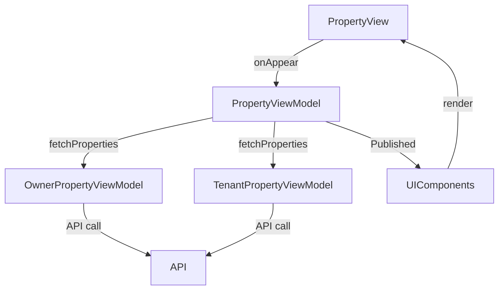

# Property Screen

## UI Components

* `NavigationStack`: Manages navigation for the screen.
* `TopBar`: Displays the app title ("Keyz").
* `ProgressView`: Shows a loading indicator during data fetch.
* `ErrorNotificationView`: Displays error messages when they occur.
* `PropertyCard`: Displays individual property details (photo, name, address, status) in a clickable card.

---

## ViewModel

### `PropertyViewModel`

* Manages:
  * `properties`: List of `Property` objects.
  * `damages`: List of `DamageResponse` objects.
  * `rooms`: List of `PropertyRoomsTenant` objects.
  * `activeLeaseId`: Stores the active lease ID for a property.
  * `isFetchingDamages`, `isFetchingDocuments`: Track fetching states.
  * `damagesError`: Stores error messages for damages.

* Functions:
  * `fetchProperties()`: Fetches properties based on user role (owner or tenant).
  * `fetchPropertyById()`: Retrieves a specific property by ID.
  * `fetchPropertyRooms()`: Fetches rooms for a property.
  * `fetchPropertyDocuments()`: Fetches documents for a property.
  * `fetchPropertiesPicture()`: Fetches property image.
  * `createProperty()`, `updateProperty()`, `deleteProperty()`: CRUD operations for owners.
  * `createDamage()`, `fetchDamageByID()`, `fixDamage()`: Damage-related operations.
  * `uploadOwnerDocument()`, `uploadTenantDocument()`, `deleteDocument()`: Document management.
  * `fetchActiveLeaseIdForProperty()`: Retrieves active lease ID.
  * `cancelInvite()`, `endLease()`: Owner-specific lease actions.

* Sub-ViewModels:
  * `OwnerPropertyViewModel`: Handles owner-specific property operations.
  * `TenantPropertyViewModel`: Handles tenant-specific property operations.

### State Observed
* `properties`, `damages`, `rooms`, `activeLeaseId`, `isFetchingDamages`, `isFetchingDocuments`, `damagesError`.

---

## Functionality

* On appear:
  * Fetches properties via `fetchProperties()` based on user role.
  * For tenants: Sets `tenantProperty` to the first property and fetches rooms and active lease ID.
  * For owners: Displays a list of properties in `PropertyCard`s.
* Displays:
  * Tenant: Single `PropertyDetailView` for their property or a "No property" message.
  * Owner: List of `PropertyCard`s or a "No properties" message.
* Owners can create new properties via a floating `NavigationLink` button.
* Error handling: Shows `ErrorNotificationView` for errors.

---

## Data Flow

---

## Navigation

* Uses `NavigationStack` for:
  * `PropertyDetailView`: For property details on card click.
  * `CreatePropertyView`: For owners to create new properties.
* Binds `navigateToReportDamage` and `navigateToInventory` for further navigation.

---

## API Integration

* Endpoints:
  * `/owner/properties/`: For owner property operations.
  * `/tenant/leases/current/property/`: For tenant property data.
  * Other endpoints for rooms, documents, damages, and leases.
* Uses `TokenStorage` for authentication with `Bearer` tokens.
* Handles `401 Unauthorized` and other errors with safe exception handling.
