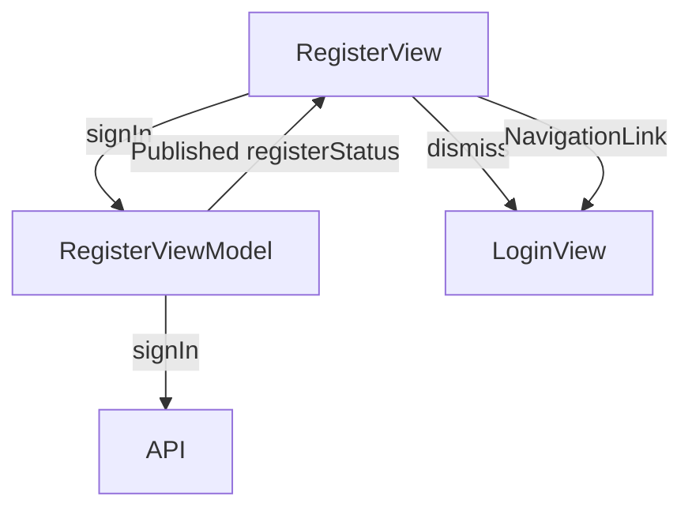

# Register Screen

## UI Components

* `NavigationStack`: Manages navigation for the screen.
* `VStack`: Organizes the layout with a logo, title, and form.
* `CustomTextInput`: Text fields for first name, name, email, password, and password confirmation.
* `Button`: 
  * Checkbox for agreeing to terms, privacy policy, and fees.
  * "Sign Up" button for submitting the registration.
  * "Log In" link for navigating to the login screen.
* `ErrorNotificationView`: Displays success or error messages.
* `ProgressView`: Shows a loading indicator during registration.
* `Image`: Displays the "KeyzLogo" in the top bar.

---

## ViewModel

### `RegisterViewModel`
* Manages:
  * `model`: Contains registration data (`firstName`, `name`, `email`, `password`, `passwordConfirmation`, `agreement`).
  * `registerStatus`: Stores the status of the registration attempt (e.g., "Registration successful!" or error messages).
* Functions:
  * `signIn()`: Sends registration data to the API to create a new user account.

### State Observed
* `showAlert`, `alertMessage`, `isRegistrationSuccessful`, `successAlert`, `isLoading`: For managing UI feedback and navigation.
* Observes `viewModel.registerStatus` for registration outcomes.

---

## Functionality

* Displays a form for user registration with fields for:
  * First name (required).
  * Name (required).
  * Email (required).
  * Password (required).
  * Password confirmation (required).
  * Agreement checkbox (required).
* On "Sign Up" button press:
  * Validates that all required fields are filled and agreement is checked.
  * Calls `signIn()` to send registration data to the API.
  * Shows a loading indicator (`ProgressView`) during the API call.
  * On success:
    * Displays a success message via `ErrorNotificationView`.
    * Dismisses the view after 2 seconds and navigates to `LoginView`.
  * On failure:
    * Displays an error message via `ErrorNotificationView`.
* "Log In" link navigates to the `LoginView`.
* "Cancel" not explicitly shown but handled via `dismiss()` on success.

---

## Data Flow

---

## Navigation

* Uses `NavigationStack` for navigation context.
* `dismiss()`: Closes the view on successful registration.
* `NavigationDestination`: Navigates to `LoginView` when `isRegistrationSuccessful` is true.
* `NavigationLink`: Provides a link to `LoginView` for existing users.

---

## API Integration

* Endpoint: Likely `/register` or similar (not explicitly shown) for creating a new user account.
* Uses `TokenStorage` for managing authentication tokens post-registration (assumed, as in other views).
* Handles errors:
  * Displays localized error messages via `ErrorNotificationView` based on `registerStatus`.

---

## Helper Features

* Input validation: Disables "Sign Up" button if any required field is empty or agreement is unchecked.
* Accessibility: Identifiers (`AgreementButton`, `SignUpButton`) for UI testing and accessibility support.
* Localization: All text is localized using `.localized()` for multilingual support.
* Animation: Subtle scale effect on the "Sign Up" button when loading.
